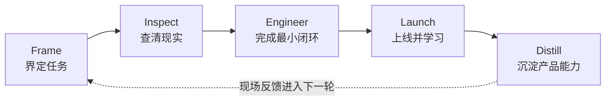

# Forward Deployed Engineer（FDE）面试 Fieldbook

> 一部有来源、重生产、可持续更新的 Forward Deployed Engineer 面试指南。

[English](README.md) · [学习地图](docs/zh-CN/reading-map.md) · [从这里开始](docs/zh-CN/00-start-here.md) · [Field Case Lab](interview-kits/cases/README.md) · [答案校准](docs/zh-CN/12-answer-calibration.md) · [参与共建](CONTRIBUTING.md)

FDE 面试真正难的地方，不是“既考代码又考沟通”这么简单。它要确认一件更现实的事：当客户只给你一个模糊目标、混乱数据、复杂权限和紧迫时间时，你能否找准问题，亲手把最小闭环做出来，让它稳定进入生产，并把一次项目经验沉淀成下一次可以复用的产品能力。

这不是一份押题集，而是一套面试与工作的共同操作系统。项目提供：

- 基于 2026 年官方岗位信息整理的 FDE 类型与能力模型；
- 从岗位理解、客户发现、编码、数据、系统设计到生产 AI 的完整主线；
- RAG、Agent、上下文工程、MCP、A2A、评测、可观测性、长任务恢复与安全治理；
- 原创讲解案例，以及分离候选人/面试官材料、按轮释放证据的 Field Case Lab；
- 来源、时效和修改记录，让项目可以在 GitHub 上长期迭代，而不是发布后迅速过期。

## 第一次来，先不要通读

根据你现在的问题，直接选择入口：

- **10 分钟判断从哪开始：** 使用[学习地图](docs/zh-CN/reading-map.md)，只留下三个高优先级训练任务。
- **一周内准备面试：** 执行[七天冲刺](docs/zh-CN/10-study-plans.md#七天冲刺)，完成一次录像模拟和一页复盘。
- **知识不少，但回答仍然很散：** 使用[答案校准](docs/zh-CN/12-answer-calibration.md)，看清 2 分、3 分和 4 分回答的证据差异。
- **系统设计总是先画技术架构：** 进入[完整案例](docs/zh-CN/07-casebook.md)，练习从工作流、约束和风险推导方案。
- **案例已经看懂，想检验现场反应：** 进入[Field Case Lab](interview-kits/cases/README.md)，让同伴按轮释放证据，不提前打开答案。
- **想把面试方法带进企业项目：** 使用[企业落地作战手册](docs/zh-CN/13-field-operating-playbook.md)和九份现场模板。

## 先记住一条主线：FIELD

`Frame` 说清谁使用、哪段流程和什么结果算成功；`Inspect` 查数据、系统、权限与组织约束；`Engineer` 做真实的端到端最小闭环；`Launch` 用评测、灰度、采用率和事故继续学习；`Distill` 把一次交付变成可复用的产品能力。

FIELD 不是为了制造缩写，而是防止候选人一听到需求就开始画 RAG 或 Agent 架构。FDE 的专业性，首先体现在能够延迟解法，先弄清现实。

## 这份指南与常见题库有什么不同

现有材料通常有三个问题：一是大量重复，读得很多却没有形成主线；二是偏重通用算法或 AI 名词，忽略客户工作流、上线采用和产品反馈；三是把来源不明的“真实面经”写成确定事实。

本项目采用另一套标准：

1. **能力模型先于题目数量。** 每个问题都要对应明确的观察维度。
2. **解释推理，不鼓励背话术。** 答案会说明先问什么、为何这样判断、边界在哪里。
3. **生产责任贯穿始终。** 不只讨论模型效果，还讨论数据同步、权限、评测、回滚、审计、成本和采用率。
4. **事实和经验分级。** 官方来源、交叉印证和社区经验不会混写。
5. **公开项目不碰版权灰区。** 不上传原始资料包、付费 PDF 或泄露题目，只发布原创重构内容。

## 完整目录

展开十四章完整目录

1. [开始之前：如何使用这套指南](docs/zh-CN/00-start-here.md)
2. [FDE 到底负责什么](docs/zh-CN/01-role-map.md)
3. [面试全景与评分逻辑](docs/zh-CN/02-interview-loop.md)
4. [客户发现与问题拆解](docs/zh-CN/03-discovery.md)
5. [编码、数据与交付基本功](docs/zh-CN/04-coding-data-delivery.md)
6. [从工作流出发做系统设计](docs/zh-CN/05-system-design.md)
7. [2026 生产 AI 必修课](docs/zh-CN/06-production-ai.md)
8. [三个完整案例](docs/zh-CN/07-casebook.md)
9. [高频问题与推理式详解](docs/zh-CN/08-question-bank.md)
10. [行为面、利益相关者与演示翻车](docs/zh-CN/09-behavioral.md)
11. [七天与三十天训练计划](docs/zh-CN/10-study-plans.md)
12. [简历、作品集与项目叙事](docs/zh-CN/11-portfolio.md)
13. [十二道核心题的答案校准](docs/zh-CN/12-answer-calibration.md)
14. [企业落地作战手册](docs/zh-CN/13-field-operating-playbook.md)

## 练习工具

- [Field Case Lab：三套可主持的分轮案例](interview-kits/cases/README.md)
- [案例包运行与评分标准](interview-kits/cases/facilitation-standard.md)
- [FDE 总评分表](interview-kits/rubrics/master-scorecard.md)
- [客户发现评分表](interview-kits/rubrics/discovery-scorecard.md)
- [系统设计评分表](interview-kits/rubrics/system-design-scorecard.md)
- [90 分钟 AI FDE 模拟面试](interview-kits/mock-loops/ai-fde-90-minute.md)
- [60 分钟经典 FDE 模拟面试](interview-kits/mock-loops/classic-fde-60-minute.md)
- [评审者校准指南](interview-kits/rubrics/reviewer-calibration.md)
- [FDE 现场交付模板包](interview-kits/worksheets/field-delivery-pack.md)

真正练过以后，如果某个示例仍然空泛、某项约束不符合企业现实，或者你的第二版回答没有改善，请提交[练习反馈](https://github.com/dataPro-lgtm/fde-interview-fieldbook/issues/new?template=practice-feedback.yml)。反馈重点是“哪里没有帮助”，不需要提供公司名称或真实面试题。

## 项目如何保持更新

所有时效性事实都进入 [`data/sources.json`](data/sources.json)，记录来源类型和最近核验日期。项目按月检查来源新鲜度；岗位要求、协议规范或安全基线发生变化时，通过结构化 Issue 更新。重要变化写入 [CHANGELOG](CHANGELOG.md)，后续计划放在 [ROADMAP](ROADMAP.md)。

本次素材审计、代码样例反向验收和发布验收均有公开记录：[素材审计](docs/research/corpus-audit.md) · [v0.1 验证记录](docs/research/release-validation-0.1.md)。

## 许可与声明

本项目使用 [MIT License](LICENSE)。它是独立教育资料，与文中提到的任何公司均无隶属或背书关系。招聘要求和面试流程会变化，实际安排请以招聘方当期信息为准。
