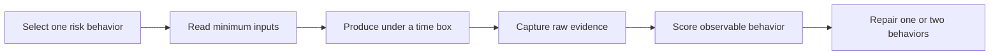

# Guided practice: turn reading into observable evidence

> **Best for:** readers who understand the FDE role but still do not know what to practice today 
> **First pass:** 15 minutes, then choose one 7-, 14-, or 30-day path 
> **Output:** one route, two risk behaviors, and dates for the first three sessions

## Reading is an input, not completion

Familiarity grows quickly when you reread architecture, agent, and interview material. Interview evidence does not. Under pressure, you still need to frame a workflow, expose unknowns, choose a thin release, control production risk, update a decision, and leave an inspectable artifact.

The v0.6 practice system separates four things:

1. chapters explain mechanisms and boundaries;
2. a path orders deliberate-practice sessions;
3. each session produces an inspectable learner artifact;
4. completion checks describe behavior, not page views.

The authoritative path contract is [`data/learning-paths.json`](../../data/learning-paths.json). It exists so links, order, outputs, and completion rules can be validated as the repository evolves.

## Choose one route

| Constraint | Route | Minimum exit evidence |
| --- | --- | --- |
| Interview within one week | 7-day interview sprint | One project spine, one design page, one blind mock, one targeted retry |
| One public target JD | 14-day role-targeting campaign | Bounded role brief, D/A/E/G matrix, role artifact, blind score, repair cycle |
| Build interview and field foundations | 30-day field-ready foundation | Runnable thin slice, operating contracts, two cases, portfolio evidence map |

Do not run all three. Deliberate practice consumes attention through production, scoring, and repair; selecting more paths usually reduces useful repetitions.

## The session loop

A useful risk is observable. “Improve system design” is not. “Confirm the user action, current baseline, and highest-risk unknown before naming components” is.

An output may be a recording, implementation, test result, design, role brief, score sheet, or incident timeline. A summary of what you learned is not enough by itself. Use the [practice journal](../../interview-kits/worksheets/practice-journal.md) to keep the first attempt, evidence, score, repair, and second attempt separate.

## How the routes differ

### Seven days

The sequence is intentionally narrow: risk baseline, project spine, discovery, workflow-first design, production AI boundaries, blind mock, and targeted repair. If no independent reviewer is available, label the score as self-assessment and preserve confidence limits.

### Fourteen days

Start with public role facts, interview hypotheses, and D/A/E/G evidence. Do not rewrite the resume before deciding which claims have direct, adjacent, exercise, or gap evidence. Select one primary [role playbook](../../interview-kits/role-playbooks/README.md), create one role-specific artifact, then run its blind loop.

### Thirty days

Build distinct artifacts for workflow discovery, a runnable technical slice, evaluation, tool authority, durable execution, data lifecycle, regulated risk, incident response, adoption, handoff, and product leverage. One diagram cannot prove all of them. The path ends with two blind cases and a truthful claim-to-artifact portfolio map.

## Solo and facilitated evidence are different

Solo practice can establish an A1 repository artifact: lock the time box, avoid solution material, record the attempt, pause before scoring, cite exact evidence, and label the reviewer as self. It cannot establish reviewer agreement.

In facilitated practice, the interviewer should release evidence only after a valid question or scheduled injection, allow new evidence to overturn earlier plans, and score statements or artifacts rather than personality. If the material needs author explanation, record that as a content defect.

## Completion means exit evidence exists

A route is complete only when:

- every session has an inspectable output;
- completion checks can be supported by statements, files, or tests;
- at least one performance is scored;
- at least one low behavior anchor is retried;
- direct, adjacent, exercise, and gap evidence remain honest;
- missing reviewers and unresolved weaknesses remain visible.

This evidence shows that a protocol was followed. It does not establish interview pass rate, employment, compensation, or universal learner outcomes.

## Start now

Choose one route, copy the [practice journal](../../interview-kits/worksheets/practice-journal.md), name two risk behaviors, and schedule the first three sessions. Complete the first artifact before expanding the reading list.

---

[English reading map](reading-map.md) · [Job targeting](job-targeting.md) · [Practice journal](../../interview-kits/worksheets/practice-journal.md)
