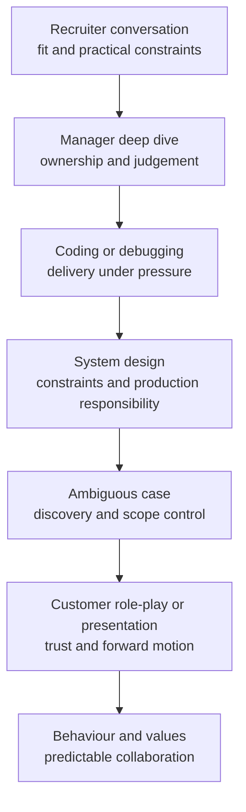

# FDE interview loop and scoring logic

> **Best for:** candidates who want to understand what each round observes instead of guessing one company's exact process. 
> **First read:** about 10 minutes. 
> **Output:** one round-to-evidence matrix and one baseline score.

## 1. The boundary first

There is no universal FDE interview loop. Company, team, level, geography, and hiring cycle all change the format. This chapter describes recurring observation problems, not an employer's official sequence. Confirm the live format with the recruiter.

## 2. A common observation chain

Some roles merge design and customer cases. Some use algorithms, practical APIs, SQL, debugging, a take-home build, or an executive conversation. The labels matter less than the evidence being collected.

## 3. What each stage is trying to observe

### Recruiter conversation: role fit

This is not a technical exam, but it quickly reveals whether you understand the role, accept the customer and travel reality, communicate clearly, and have a stronger motive than “AI is hot.”

Prepare a 90-second positioning statement, the archetype you are targeting, two strong evidence anchors, and honest location or travel constraints.

### Manager deep dive: ownership and judgement

Expect one project to be opened repeatedly: why it mattered, who decided, what you owned, which risk changed the plan, what result moved, and what you would do differently. Technology lists collapse under this questioning; decisions and consequences survive it.

Prepare three project stories in two-, ten-, and twenty-five-minute versions.

### Coding or debugging: can you still ship under pressure?

The final output matters, but so do interface clarification, decomposition, tests, error handling, complexity, communication, and recovery after a wrong turn. The target role may use algorithms, data processing, API work, or an unfamiliar codebase.

Prepare a repeatable loop: clarify, make examples, choose a plan, implement, test, inspect failure, and state complexity or operational limits.

### System design: can reality become architecture?

Strong answers begin with users, workflow, scale, risk, and success. They then derive data flow, control flow, state, authorization, reliability, evidence, rollout, and adoption. Weak answers begin with a vendor diagram.

Prepare to move from mission to rollout in 45 minutes and to reallocate time when the interviewer chooses a deep dive.

### Ambiguous case: the signature FDE skill

The prompt is incomplete on purpose. The interviewer watches whether you slow down, separate symptoms from causes, prioritize the missing facts, choose a thin end-to-end slice, and connect technical work to user and business value.

Prepare the FIELD loop, an assumption ledger, and a one-page mission memo.

### Customer role-play or presentation: trust with boundaries

The other person may act as an impatient executive, skeptical engineer, strict security reviewer, or scope-expanding business owner. The goal is not agreement at any cost. It is honest progress under pressure.

Prepare to decline an unsafe or unbounded ask while offering an alternative path, an evidence plan, and a next decision.

### Behaviour and values: predictable collaboration

The interviewer wants to know what you do when a demo fails, scope conflicts, customers do not cooperate, or teams disagree. A useful story contains facts, individual action, impact, and a mechanism changed afterwards. It does not need a perfect hero.

## 4. Eight training dimensions

This fieldbook uses a 100-point practice model. It is not any employer's internal weighting.

| Dimension | Suggested weight | Observable evidence |
| --- | ---: | --- |
| Discovery and decomposition | 15 | workflow, root cause, priority, scope |
| Value, product judgement, and adoption | 10 | baseline, business metric, user behaviour, change management |
| Coding, debugging, and end-to-end delivery | 15 | correctness, tests, clarity, recovery |
| Data engineering and system design | 15 | data flow, state, scale, idempotency, consistency |
| AI application engineering | 15 | RAG/agent choice, context, tools, model limits |
| Evals, reliability, observability, and cost | 15 | golden set, traces, SLOs, fallback, budget |
| Security, permissions, and governance | 10 | least privilege, tenant isolation, audit, approval, threat model |
| Communication, handoff, and productization | 5 | clarity, conflict handling, reuse, enablement |

A critical score of one can be a rejection risk even when the total looks acceptable. Strong AI knowledge does not compensate for unsafe authorization; polished architecture does not compensate for an inability to write and debug code.

## 5. Four behavioural anchors

### 1 — unsafe

Chooses technology before clarifying the problem, cannot produce evidence, promises unverifiable outcomes, or becomes inconsistent under follow-up.

### 2 — developing but unstable

Covers the expected structure with prompting, names risks without controls, or has project experience but cannot isolate personal ownership and results.

### 3 — independently deliverable

Derives a bounded solution from reality, manages risk and metrics, demonstrates solid engineering, and explains rollout and handoff.

### 4 — creates organizational leverage

Solves the immediate problem and improves the next deployment: identifies irreversible risk early, handles technical and organizational tension, and turns recurring field learning into product, policy, tests, or reusable assets.

Use the printable [master scorecard](../../interview-kits/rubrics/master-scorecard.md) for practice.

## 6. How an answer moves from two to four

Question: “The customer says the RAG system is inaccurate. What do you do?”

A two-level answer immediately tunes chunk size, embeddings, top-k, a reranker, or the model. Those may be useful changes, but the answer has assumed the failing layer.

A three-level answer first turns “inaccurate” into reproducible cases, buckets them by user, intent, corpus, and time, then identifies the first failure: missing document, stale or deleted content, wrong permissions, retrieval miss, context assembly, unsupported generation, or a product-expectation problem. It changes the dominant cause, compares against a golden set and shadow traffic, and rolls out gradually.

A four-level answer also asks about business harm, high-risk intents, recent data/prompt/model/tool/policy changes, rollback, version attribution, online detection, and how failures enter the regression set. It ends by deciding which reusable control should prevent recurrence: freshness SLO, permission canary, layered eval, or release gate.

Level four is not longer by definition. It connects current diagnosis, safe change, and organizational learning.

## 7. Frequent rejection signals

- solving before clarifying;
- not knowing the user or workflow;
- treating a demo metric as the business outcome;
- promising perfect accuracy or no hallucinations;
- adding an agent, multi-agent system, or vector database to every problem;
- omitting identity, tenant, and sensitive-data boundaries;
- avoiding tests or being unable to explain the code;
- discussing incidents without impact, rollback, or communication;
- blaming the customer rather than improving the mechanism;
- presenting community interview reports as official process;
- hiding individual contribution behind “we.”

## 8. Ask the recruiter professionally

You can ask:

> To prepare for the actual format, is the coding stage closer to algorithms, practical application work, or debugging? Does system design include AI or data scenarios? Is the customer case mainly discovery, or should I also complete a technical design? Which documentation or coding tools are permitted?

This reduces format uncertainty without requesting confidential questions.

## 9. Ten-minute post-interview review

Record:

1. what was actually asked;
2. where your structure broke;
3. which fact or skill was missing;
4. which correct answer lacked evidence;
5. where the interviewer kept probing;
6. the two behaviours you will change next time;
7. any public role signal that should update your target model.

Repeated probing is usually more useful than facial expression. It often marks missing evidence, boundaries, or decision logic.

---

[← Role map](role-map.md) · [English reading map](reading-map.md) · [Workflow-first system design →](system-design.md)
