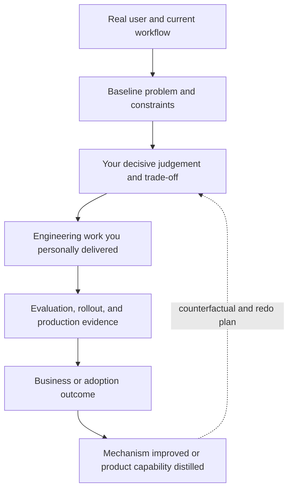

# Resume, portfolio, and project evidence

> **Best for:** candidates whose resume contains technology names but little customer outcome, personal judgement, or production evidence. 
> **First read:** about 10 minutes; allow 30 minutes to rewrite. 
> **Output:** one project summary, three evidence-based bullets, and one presentation spine.

## 1. What an FDE resume must prove

A strong resume lets a reviewer find three forms of evidence quickly:

1. you can personally build and debug a complex system;
2. you can define a problem and drive adoption in a real user environment;
3. you accept responsibility for production outcomes, risk, and reusable capability.

“Built a support chatbot with Python, LangChain, and a vector database” proves none of them by itself.

## 2. A bullet structure that survives follow-up

Use:

> In **[user or business workflow]**, facing **[baseline problem]**, I **[personally owned the decisive action and trade-off]** through **[only the necessary technology or mechanism]**, changing **[business, adoption, or system result]** by **[verified measure]**, and leaving **[a durable control or reusable asset]**.

Weak:

> Built an intelligent customer-service system using Python, FastAPI, Redis, LangChain, and OpenAI.

Stronger:

> Launched a permission-aware policy-recommendation workflow for 120 support agents; I owned document-version and ACL synchronization, layered RAG evals, and staged rollout, reducing median refund-ticket first response from 14 to 8 minutes while blocking cross-tenant regressions with canaries and a deletion-propagation SLO.

Use numbers only when you can verify and explain them. Without a business metric, use honest scope, frequency, time, complexity, risk reduction, or behaviour change.

## 3. Three useful kinds of numbers

- **Business:** time, cost, loss, conversion, resolution, backlog, adoption.
- **Engineering:** latency, reliability, recovery, freshness, release frequency, quality gates.
- **Scope:** users, tenants, data volume, systems, regions, roles, languages, delivery duration.

One or two meaningful numbers are usually enough. More numbers do not make a story more credible.

## 4. A portfolio should expose the full loop

Even a personal project can demonstrate FDE judgement. Its README should cover:

1. user and current workflow;
2. problem, baseline, and non-goals;
3. why this solution was chosen;
4. data, control, and evidence flows;
5. authorization and threat model;
6. eval set and failure taxonomy;
7. local run instructions and test evidence;
8. fault injection and fallback;
9. result and known limits;
10. the next validation required in a real customer environment.

Do not disguise a local exercise as a million-user production platform. An explicit design exercise with measured tests is more credible than fictional scale.

## 5. Three portfolio shapes

### Production-aware AI workflow

Go beyond the chat surface. Add a deliberate subset of permissions, document versions, evals, traces, action approval, idempotency, durable tasks, or fault injection. Explain why each control exists.

### Data and operations system

Turn messy multi-source data into a decision loop: identity resolution, quality rules, late and deleted data, metric definition, action owner, and feedback. This proves that FDE work is not limited to model calls.

### Discovery and design case

Choose a domain you understand. Document the current process, interview assumptions, thin slice, architecture, risk, metric, and rollout. Label it as a simulation and do not invent a customer.

One project you can discuss for twenty-five minutes is more valuable than three shallow demos.

## 6. A ten-slide project presentation

1. user and business context;
2. current workflow and root cause;
3. mission, metrics, and non-goals;
4. thin slice and delivery stages;
5. data, control, and evidence architecture;
6. the two hardest decisions;
7. evaluation, security, and reliability;
8. rollout, adoption, and measured result;
9. failure, incident, or surprise;
10. product feedback, reusable assets, and redo plan.

Put detailed schemas, code, metric definitions, and rejected alternatives in an appendix for follow-up.

## 7. A 90-second introduction

Use: current professional identity → strongest engineering spine → user or customer context → one production evidence point → why the target role is a natural next step.

Do not narrate your resume from graduation forward. “I love AI” is not a role motive. A credible FDE motive connects to a pattern already visible in your choices: approaching users, handling ambiguity, building personally, and owning the result.

## 8. Explain a transition without hiding the gap

### Software engineering to FDE

Show where you approached users, handled rollout, or resolved cross-team ambiguity. Add discovery and adoption evidence.

### Data engineering to FDE

Lead with data quality, reliable pipelines, and real decisions. Add product interaction, model non-determinism, and customer communication.

### Solutions or pre-sales to FDE

Lead with discovery and executive communication. Provide recent evidence that you personally coded, tested, debugged, and carried a change into operation.

### Consulting to FDE

Lead with domain learning and organizational change. Prove that you can turn advice into a running system and retain technical responsibility.

## 9. Remove these claims

- percentage improvements without a baseline;
- “production-grade” without users, monitoring, failure, or rollout evidence;
- team results presented as individual work;
- models or frameworks you cannot explain under follow-up;
- customer names or sensitive details;
- mastery of every AI topic;
- community practice presented as customer deployment.

## 10. Final test

Give the resume to someone who does not know the project and ask:

1. What is this candidate's strongest technical spine?
2. For whom did they solve which problem?
3. What did they personally build or decide?
4. Which production responsibility did they own?
5. Which result can be verified?
6. Which FDE archetype does the evidence support?

If the reader can only repeat tool names, rewrite again.

---

[← Production AI](production-ai-2026.md) · [English reading map](reading-map.md) · [Start here](start-here.md)
