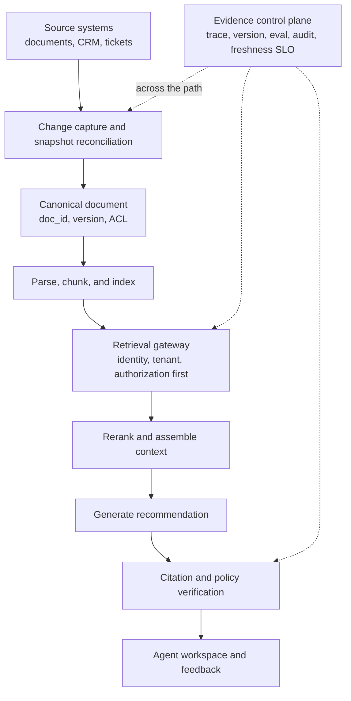

# Workflow-first system design

> **Best for:** candidates whose design answers become component inventories or add permissions, rollback, and rollout at the end. 
> **First read:** about 15 minutes; practise for 45 minutes. 
> **Output:** one design containing data, control, and evidence flows.

## 1. System design is not a cloud-service memory contest

The FDE problem is to make bounded decisions while requirements are incomplete, data is messy, and delivery pressure is real. Interviewers usually care whether you:

- define the user, workflow, and success before selecting technology;
- locate the highest-risk and least-reversible boundary;
- match architecture to scale, reliability, and the customer's operating capacity;
- explain trade-offs and the evidence that would change your choice;
- continue the design through release, observation, rollback, adoption, and handoff.

## 2. A 45-minute shape

| Time | Goal |
| --- | --- |
| 0–7 minutes | user, workflow, requirements, scale, harm, success |
| 7–12 minutes | APIs, core objects, success and failure semantics |
| 12–25 minutes | high-level data, control, and evidence flows |
| 25–35 minutes | two decisive deep dives: permissions, reliability, retrieval, sync, or another risk |
| 35–42 minutes | evals, observability, cost, rollout, and rollback |
| 42–45 minutes | trade-offs, open questions, and the next validation |

If the interviewer redirects the discussion, say how you are reallocating time. Structure is a tool for coverage, not a script that overrides the conversation.

## 3. Begin with the mission

Confirm in two or three sentences:

- who uses the system and at what moment;
- which current step is painful;
- whether the system advises, decides, or acts;
- which outcome should improve and which error is unacceptable;
- the first-stage scale, time horizon, and non-goals.

Those answers decide whether the solution is search, an assistant, a deterministic workflow, or an agent; synchronous or asynchronous; advisory or automated; strongly or eventually consistent.

## 4. Draw three flows at once

| View | What must appear | Consequence if omitted |
| --- | --- | --- |
| Data flow | sources, versions, transformations, stores, retrieval, inherited permissions | cannot know whether data is correct, current, or visible |
| Control flow | trigger, state, retry, approval, termination, compensation | only the happy path exists; failures cannot recover |
| Evidence flow | trace, version fingerprint, citation, eval, audit, feedback | regressions, incidents, and responsibility become guesswork |

The evidence flow is not “logging.” It connects each outcome to the input, model and prompt, retrieved content, tool calls, policy decisions, approvals, and user response needed to evaluate or reconstruct it.

## 5. Define objects and state explicitly

For an enterprise assistant, distinguish at least:

- `Conversation`: interaction history, not the business task itself;
- `Task`: a trackable goal and lifecycle;
- `Document`: logical identity, version, permissions, and deletion state;
- `ToolCall`: request, arguments, identity, idempotency key, and result;
- `Approval`: who approved which version of an action and when;
- `Trace`: request chain and decision evidence;
- `EvalCase`: input, expected behaviour, labels, version, and provenance.

Putting all state into a chat session makes long-task recovery, audit, concurrent work, and reconnects unnecessarily fragile.

## 6. Capacity estimates must change a decision

Ask about daily and peak traffic, concurrency, burst, document or event volume, update and delete frequency, model/tool latency, rate limits, retention, data residency, acceptable staleness, recovery time, and data loss.

The purpose is to choose sync versus async, cache versus recomputation, batch versus stream, partitioning, queues, index strategy, and degradation. False precision is less valuable than a clear threshold that would change the architecture.

## 7. Reliability is part of the object model

### Timeout and retry

Every external call needs a timeout. Separate transient from permanent errors, use bounded backoff and jitter, and stop retry storms from multiplying downstream load.

### Idempotency and side effects

Models can repeat actions, and clients can lose the result of a successful request. Writes need a business idempotency key. Irreversible actions need approval, compensation, or reconciliation.

### Degradation

If the model fails, can the product fall back to search, a template, a human queue, or read-only mode? If vector retrieval fails, is keyword search safe enough? Degradation must never bypass authorization.

### Isolation

Bound blast radius by tenant, customer, task class, or worker pool. One customer's long-running workload must not consume all capacity.

### Recovery

Persist task state independently of the browser and pod. Long work needs checkpoints, replay, cancellation, resumption, and human signals.

## 8. Permissions cannot be the final box

Answer early:

- how user identity reaches data and tools;
- where tenant, RBAC, ABAC, and purpose restrictions are enforced;
- which context the model can see and whose credential a tool uses;
- whether actions use delegated user identity or a service identity;
- which actions require step-up authentication or approval;
- how logs, traces, and eval datasets are redacted and retained;
- how connector, MCP server, and skill provenance is trusted;
- how quickly revocation reaches indexes and caches.

The core invariant is simple: authorization is enforced before context retrieval and before action execution, never delegated to a prompt.

## 9. AI-specific design decisions

Choose models by task quality, structured output, tool ability, latency, cost, data boundary, and availability. A fallback route must not silently assign a high-risk task to a less capable model.

Observe RAG as separate ingestion, parsing, chunking, authorization, retrieval, reranking, context assembly, generation, and citation-verification layers. “RAG accuracy” is not one diagnosable number.

For an agent, define goal, tools, state, stop conditions, maximum steps, budget, approval, recovery, and audit. Prefer deterministic orchestration for fixed high-risk workflows, with models at bounded judgement points.

Treat system instructions, tools, examples, retrieved data, history, and memory as a budgeted and permissioned context plane. Every part can be stale, excessive, sensitive, or adversarial.

## 10. Release is not an appendix

A useful rollout can progress through:

1. offline historical replay;
2. shadow mode with no user effect;
3. internal or expert-user suggestion mode;
4. limited cohort with human review;
5. low-risk action automation;
6. expansion by quality, adoption, and incident budget;
7. explicit rollback, kill switch, and support path.

Each stage needs entry, exit, pause, and rollback conditions. A model score can improve while user bypass, review burden, or permission failures make expansion unsafe.

## 11. Example: multi-tenant enterprise knowledge assistant

Mission: help support staff find current policy and draft cited guidance. The first stage does not execute account actions. Tenant and role isolation are strict; policy changes should become visible within 15 minutes.

Deep dive one: synchronization and deletion. Use a stable `doc_id`, versions, tombstones, permission changes, failure isolation, replay, and source-to-target reconciliation.

Deep dive two: unauthorized access. Propagate identity, filter before retrieval, partition caches, run cross-tenant canaries, redact traces, and separate admin from ordinary content.

Evaluate document availability, permission correctness, recall at k, citation support, answer utility, high-risk error rate, latency, and recommendation adoption. Permission violations are blockers and cannot be averaged away by good answer quality.

## 12. Express a trade-off completely

A complete trade-off contains:

1. the current decision objective;
2. the relevant difference between options;
3. why one fits the current stage;
4. its risk and compensating control;
5. a measured trigger for migration.

Example:

> For the first stage I would keep documents, versions, ACLs, and vectors in Postgres with pgvector so they share a manageable transaction boundary. The risk is scale and retrieval flexibility, so I would monitor index size, p95 latency, and recall by tenant. If validated volume or concurrency crosses the threshold, I would move retrieval behind a dedicated service while preserving the retrieval-gateway contract.

That is more actionable than “start simple and scale later.” Practise with the [system-design scorecard](../../interview-kits/rubrics/system-design-scorecard.md).

---

[← Interview loop](interview-loop.md) · [English reading map](reading-map.md) · [Production AI →](production-ai-2026.md)
