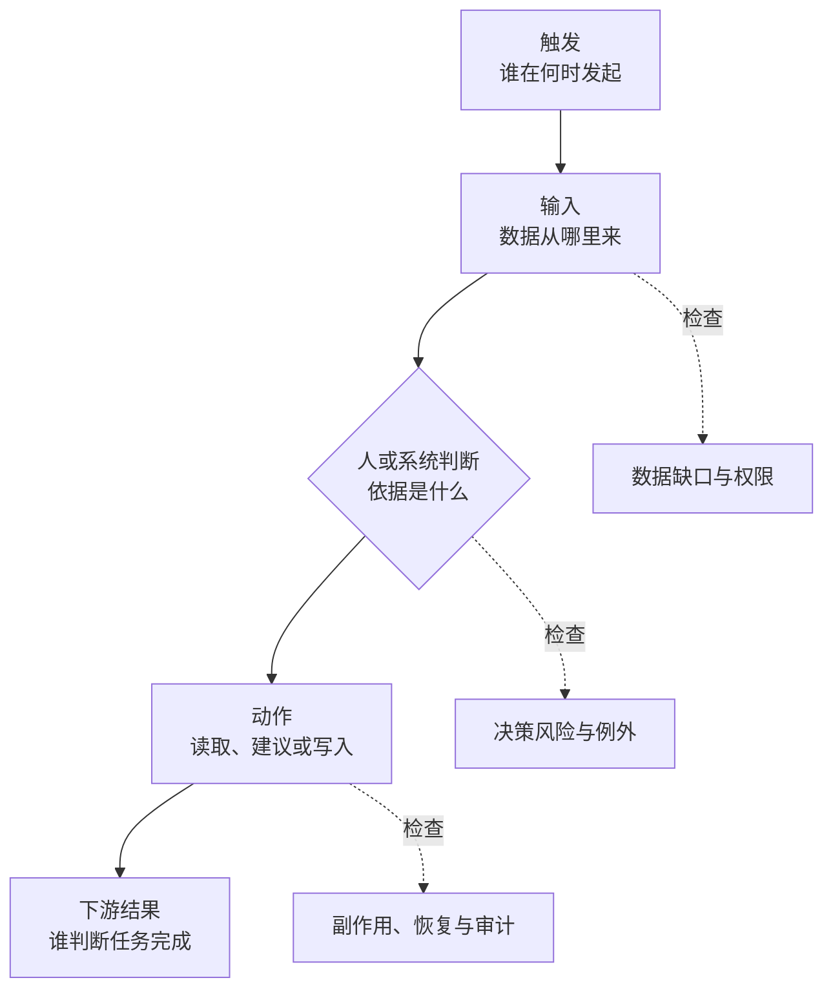

# 客户发现与问题拆解

> [!NOTE]
> **适合谁：** 一听到需求就开始给方案，或者不会把模糊目标问清楚的人 
> **首次通读：** 12 分钟；建议练习 30 分钟 
> **完成后产出：** 当前工作流、问题陈述、thin slice 与验收标准

## 1. 为什么这一轮最像真实工作

在真实现场，客户很少给出完整、稳定、内部一致的需求。业务负责人想要速度，安全团队要求控制，工程团队担心维护，最终用户可能根本不想改变流程。FDE 的第一项技术能力，是把这些冲突转换成可验证的问题。

发现不是“多问几个问题”。它要产出一个团队可以共同承担的 mission。

## 2. 先画当前工作流

任何方案前，先回答七个问题：

1. 谁触发流程？
2. 输入从哪里来？
3. 谁在什么节点做判断？
4. 使用哪些系统和数据？
5. 输出进入谁的下一步？
6. 哪里最慢、最贵、最容易错或风险最高？
7. 失败后现在如何发现和恢复？

一个简单模板：

很多“AI 需求”在画完现状后会变成更小的问题。例如“自动处理所有工单”可能真正卡在分类不一致、知识库过期和升级规则缺失。此时先修数据和规则，可能比上 Agent 更快产生价值。

## 3. 问题要按信息价值排序

面试时间有限，不要像调查问卷一样逐条问。优先问会改变方案类别的问题。

### 第一层：结果与代价

- 如果三个月后项目成功，哪个具体行为或指标会改变？
- 现在一次错误、漏处理或等待的代价是什么？
- 谁最终决定是否扩大使用？

这层决定问题值不值得做，以及成功由谁定义。

### 第二层：工作流与用户

- 谁每天使用？频率和峰值如何？
- 当前步骤是什么，人在哪些地方补判断？
- 用户如果不信任结果，会怎么绕过系统？

这层决定产品形态和采用风险。

### 第三层：数据与系统

- 哪些系统是事实来源？数据多久变化？
- 是否存在租户、角色、地域或用途限制？
- 历史样本和真实失败能否用于评测？

这层决定可行性和验证方式。

### 第四层：风险与约束

- 哪些动作不可逆或需要审批？
- 哪类错误绝对不能发生？
- 时间、预算、部署、供应商或合规边界是什么？

这层决定自治程度和上线策略。

### 第五层：范围和节奏

- 哪一个用户群、意图或数据域适合先做？
- 什么可以人工兜底？
- 两周内能证明或证伪什么？

这层把发现转为计划。

## 4. 区分需求、假设与事实

建议在白板上分三栏：

| 类型 | 示例                       | 下一步               |
| ---- | -------------------------- | -------------------- |
| 事实 | 过去 30 天有 12,000 张工单 | 找数据验证分布       |
| 需求 | 希望减少人工分类时间       | 定义基线和目标       |
| 假设 | 80% 工单可以自动处理       | 用样本和风险分桶验证 |

FDE 不需要一开始知道所有答案，但必须知道自己正在依赖什么假设。资深感来自不确定性管理，不是无所不知。

## 5. 写出合格的问题陈述

一个可交付的问题陈述包含：

> 对于【目标用户】，在【触发场景】下，当前【流程步骤】因为【经验证或待验证的原因】造成【基线影响】。我们希望在【时间范围】内，通过【最小变化】把【指标】改善到【目标】，同时不突破【风险边界】。

示例：

> 对于一线支持人员，在处理重复退款请求时，当前需要在三套系统中查找政策和支付记录，平均首响 18 分钟，且 7% 被错误升级。我们希望六周内为英语地区的低金额重复支付场景提供带来源的处理建议，把首响中位数降到 8 分钟，同时不允许系统自动退款，也不得暴露其他客户记录。

这比“做一个退款 Agent”更有工程价值，因为它定义了用户、场景、基线、范围、目标和禁止项。

## 6. 成功指标要分三层

| 层级           | 要回答的问题                   | 代表性证据                               |
| -------------- | ------------------------------ | ---------------------------------------- |
| 业务与工作流   | 这项改变为什么值得做           | 处理时长、人工触点、损失、积压、解决率   |
| 产品与采用     | 用户是否真的把它纳入日常工作   | 采纳、改写、绕过、放弃、升级和活跃度     |
| 模型与系统     | 哪些工程变量支撑或破坏最终结果 | 召回、引用、任务成功、延迟、成本、违规率 |

### 业务与工作流指标

例如处理时长、人工触点、转化、损失、积压、解决率。这是项目存在的理由。

### 产品与采用指标

例如周活、建议采纳率、人工改写率、绕过率、放弃率、培训完成率。这说明系统是否进入真实工作。

### 模型与系统指标

例如任务成功率、检索 recall、引用正确率、工具调用成功率、延迟、成本、权限违规率。这些是工程控制变量。

不要用第三层替代第一层。检索 recall 提高，不代表工单更快解决。

## 7. 如何判断要不要用 Agent

用以下问题过滤：

1. 流程是否需要根据中间结果动态选择下一步？
2. 是否必须跨多个工具或数据源迭代？
3. 规则是否难以穷举但结果可以验证？
4. 失败是否可检测、可停止、可补偿？
5. 自治带来的价值是否高于非确定性和治理成本？

如果步骤固定、规则清楚、错误代价高且没有可靠验证，普通工作流、规则引擎或一个按钮往往更好。面试中主动提出这个判断，通常比一上来设计多 Agent 更有信号。

## 8. 选择 thin slice，而不是缩小版大系统

最小闭环需要同时满足：

- 使用真实或足够代表性的输入；
- 走通到用户可感知的结果；
- 包含最关键权限和风险控制；
- 能收集成功与失败证据；
- 失败时有人工或系统回退。

退款案例的 thin slice 可以是：“只处理低金额重复支付建议，系统给出政策引用和支付证据，支持人员确认后手工执行。”它并不自动退款，却已经能验证数据、检索、建议质量、用户信任和时间节省。

## 9. 面对冲突利益相关者

### 业务方要求全自动

不要简单拒绝。先确认为什么需要全自动，再把风险翻译成业务后果，给出分阶段路径：建议模式 → 低风险自动化 → 扩大范围，并定义每一阶段的准入指标。

### 安全团队不给数据

不要把对方描述成阻塞者。把用途、字段、权限、保留时间、审计和替代数据写清；提出最小字段、脱敏样本、客户环境内计算或只读访问等方案。

### 工程团队担心维护

承认隐性成本。明确谁值班、哪些组件由平台承担、哪些是客户配置、如何测试和回滚。把知识转移作为交付物，不等项目最后再补文档。

### 高管明天要演示

把“演示成功”和“生产承诺”分开。限定场景、冻结输入、准备离线兜底和失败话术，同时明确演示不能证明的事项。

## 10. 一段完整的拆解示范

题目：一家银行希望用 AI 自动审查贷款材料，两个月上线。

强回答不会立即选择 OCR、RAG 或多 Agent，而会按顺序推进：

1. **Frame**：审查是材料完整性、规则核验、风险判断还是最终批准？谁对结果负责？两个月指试点还是生产？
2. **Inspect**：材料类型和语言、当前处理量、历史缺陷、法规、数据位置、系统接口、人工复核、最危险错误。
3. **选择切片**：先做材料完整性和字段一致性检查，不做信用决策；限定一个产品和一个地区。
4. **验收**：字段提取准确率只是局部指标；还要测漏检、人工复核时间、升级率、证据可追溯和敏感数据访问。
5. **上线**：shadow 对比人工，双人复核高风险样本，按产品灰度，保留人工为最终决策者。
6. **Distill**：文档解析、证据引用、政策版本和审核队列应沉淀为共性能力；地区规则留在配置层。

面试官可能继续追问模型、架构或评测。此时你已经建立了正确问题边界，后续技术选择才有依据。

## 11. 发现阶段的常见错误

- 问很多问题，但不知道哪个会改变决策；
- 只和 sponsor 交流，不看实际用户；
- 把客户提出的解法当作需求；
- 没有当前基线就承诺提升；
- 只谈准确率，不谈错误类型和代价；
- 没有明确本阶段不做什么；
- 忘记采用、培训、支持和交接；
- 用“先做 PoC”回避真实数据、权限和验收。

## 12. 发现阶段的交付物

一次高质量发现至少形成：

1. 当前工作流图；
2. 问题陈述；
3. 利益相关者和决策权；
4. 基线与成功指标；
5. 数据/系统/权限清单；
6. 假设与验证计划；
7. thin slice 范围和非目标；
8. 风险、回退和上线阶段；
9. 下一次决策需要的证据。

练习时使用[客户发现评分表](../../interview-kits/rubrics/discovery-scorecard.md)。

---

[← 上一章：面试全景](02-interview-loop.md) · [学习地图](reading-map.md) · [下一章：编码、数据与交付 →](04-coding-data-delivery.md)
