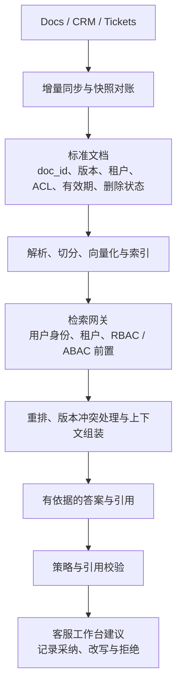
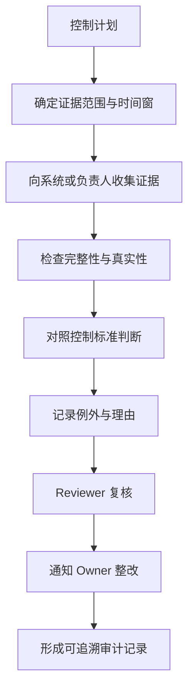
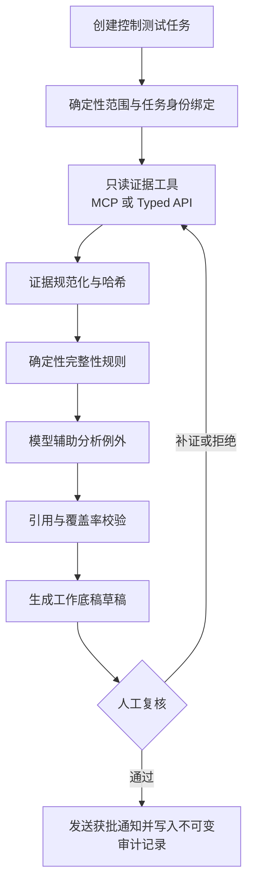
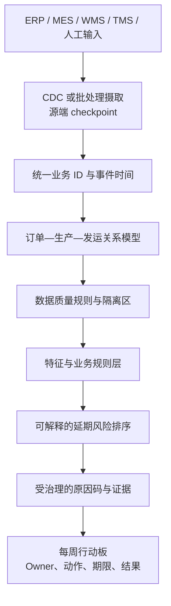

# 三个完整案例：从模糊需求到生产与产品化

> [!NOTE]
> **适合谁：** 想把发现、架构、评测、上线和产品化串成一条完整主线的人 
> **首次通读：** 30 分钟；完整演练约 90—120 分钟 
> **完成后产出：** 一次限时案例回答、一张架构图和一页决策备忘录

这三个案例都是原创教学场景，不是任何公司的真实或泄露面试题。练习时先只看题目，限时回答，再阅读推演。参考推演不是唯一解；重点是每个决策都有现实依据和失效边界。

| 案例                                                        | 最适合训练                     | 建议时间 |
| ----------------------------------------------------------- | ------------------------------ | -------: |
| [多租户客服知识助手](#案例一多租户客服知识助手)             | RAG、权限、评测与采用          |  45 分钟 |
| [受监管审计 Agent](#案例二受监管审计-agent)                 | 工具治理、审批、恢复与审计     |  45 分钟 |
| [制造企业交付延期数据项目](#案例三制造企业交付延期数据项目) | 非 AI 优先、指标口径与数据交付 |  45 分钟 |

不要一次读完三个案例。先选最接近目标岗位的一个，做到能够交付一页备忘录，再进入下一个。

## 案例一：多租户客服知识助手

### 题目

一家 B2B SaaS 公司有 800 名客服，知识散落在内部文档、工单和 CRM。管理层希望六周内上线“客服 AI”，降低首响时间。此前 demo 很好，但试用时有人拿到了其他客户的信息，政策更新后答案也经常过期。请你负责该项目。

### 这道题在考什么

- 能否把“客服 AI”拆成具体工作流；
- 是否把权限和知识新鲜度当作一等问题；
- 能否设计分层 RAG 评测；
- 是否知道六周内应该缩范围而不是缩安全；
- 能否走到用户采用和产品化。

### 弱回答会怎样开始

> 我会把文档切块，存进向量数据库，用混合检索和 reranker，再接一个强模型。

这套组件可能需要，但它没有回答：谁用、何时用、能做什么、跨客户泄漏在哪里发生、政策多快更新、六周验收什么。

### FIELD 推演

#### F — Frame the mission

先确认“降低首响”是哪个工单队列、当前基线、语言和地区。询问客服希望系统做搜索、建议、自动回复还是执行账户动作。确认跨租户泄漏属于阻断事故，第一阶段不得自动发送或修改账户。

合理的第一阶段 mission：

> 为北美英语团队的退款与账户访问两类工单，在客服工作台内提供带政策版本和来源的回答建议，把首响中位数从 16 分钟降到 9 分钟；任何跨租户或越权内容为零容忍，政策撤回后 15 分钟内不可检索。客服仍负责确认和发送。

#### I — Inspect reality

需要查看而不是只询问：

- 最近 90 天两类工单样本、处理时间和升级原因；
- 文档事实来源、owner、版本、权限和更新方式；
- CRM/工单身份如何映射租户和角色；
- 泄漏样本的完整 trace：是摄取元数据错、检索过滤晚、缓存串租户，还是前端会话复用；
- 客服当前如何判断政策是否最新，哪些私下表格是隐性事实来源；
- 用户对建议不信任时如何修改、复制或绕过。

此时建立失败分类：语料、权限、检索、上下文、生成、产品呈现。

#### E — Engineer the thin slice

高层链路：

关键决策：

1. **身份贯穿**：请求携带用户、租户和角色；权限在检索前执行；缓存键包含授权作用域。
2. **版本与删除**：稳定 `doc_id`，新版本完成索引后原子切换；撤回先 tombstone，再清理派生数据。
3. **引用是产品控件**：展示标题、版本、生效日期和支持片段，让客服能核验。
4. **不自动发送**：六周内先验证建议质量和信任，降低不可逆风险。
5. **保留确定性路径**：没有合格上下文时拒答并提供搜索/升级，不让模型“尽力猜”。

#### L — Launch and learn

评测分四层：

| 层   | 关键指标                           | 阻断条件                 |
| ---- | ---------------------------------- | ------------------------ |
| 数据 | 更新/撤回延迟、解析率、孤儿 chunk  | 撤回超 SLO               |
| 权限 | 跨租户、越权召回、缓存串租户       | 任一 confirmed leak      |
| RAG  | recall@k、版本正确、引用支持、拒答 | 高风险政策引用错误       |
| 产品 | 首响、采纳、改写、升级、绕过       | 时间改善以风险上升为代价 |

上线顺序：历史回放 → shadow → 20 名资深客服 → 一个队列灰度 → 扩大。每一步明确准入与停止条件。

线上 trace 记录版本、文档 ID、检索分数、提示版本和反馈，但不默认保存完整敏感正文。泄漏 kill switch 可立刻关闭生成，只保留原有搜索。

#### D — Distill into product

一次性内容留给客户配置，共性能力沉淀为：权限感知 retrieval gateway、文档版本/撤回协议、引用组件、评测分层、租户 canary、变更门禁和客服反馈 schema。

### 面试官可能追问

#### “为什么不直接上 Agent 自动处理？”

因为当前阻断风险来自权限和数据新鲜度，自治不能修复这两个基础问题，反而放大后果。先用建议模式验证数据、质量和用户信任；低风险、可逆且可验证的动作达到门禁后再逐步自动化。

#### “向量库挂了怎么办？”

可以降级到同样权限过滤后的关键词搜索或旧版人工流程。降级路径必须保持租户和角色约束；宁可安全拒答，也不能绕过权限。

#### “如何证明不是模型问题？”

对失败样本保存检索候选和上下文。若正确政策未进上下文，是摄取/权限/检索问题；若正确上下文已存在但答案错，才进入提示/模型/生成验证。用分层 replay 比盲目换模型更快归因。

### 五分钟回答骨架

先界定工单、用户、动作和两条硬指标；再查泄漏和过期的实际 trace；选两个意图做建议模式；设计文档版本/ACL 和权限前置检索；用分层黄金集与跨租户反例设门禁；从 shadow 到小队灰度；最后把权限 gateway、撤回协议和 eval 模板沉淀成平台能力。

---

## 案例二：受监管审计 Agent

### 题目

一家跨国企业的内部审计团队希望 Agent 自动完成季度控制测试：从多个系统收集证据、判断是否满足控制要求、生成工作底稿并提醒负责人。业务负责人希望“端到端无人值守”，因为每季度有数千项测试。审计负责人担心无法向监管者解释 Agent 的判断。

### 这道题在考什么

- 能否判断哪些步骤适合 Agent，哪些必须确定性或人工；
- 工具身份、最小权限、审批和审计；
- 长任务状态、断线恢复、幂等和补偿；
- 黄金集、证据链和人机责任；
- 如何在业务效率与受监管风险之间推进。

### 先还原当前流程

这里至少有三类工作：确定性数据获取、需要语境的分析、受责任约束的最终判断。把三者都交给一个 Agent，会让权限和责任无法分清。

### FIELD 推演

#### F — Frame

确认第一阶段目标是减少证据收集和底稿准备时间，不是让 Agent 成为审计签字人。选择一个证据来源稳定、控制定义清晰、影响可复核的控制族。定义“无人值守”背后的真实诉求：减少等待、减少重复复制，还是减少资深审计人员投入。

第一阶段问题陈述：

> 对一个低至中风险 IT 访问审查控制，Agent 负责收集指定证据、验证完整性、生成带来源草稿和标记异常；审计人员保留最终结论和签字。目标把每项准备时间从 45 分钟降到 15 分钟，证据来源、工具调用、规则/模型版本和人工修改全部可追溯。

#### I — Inspect

- 控制文本是否结构化，版本谁维护；
- 证据系统、API、权限和保留期；
- 历史工作底稿与 reviewer 修改；
- 哪些判断是规则，哪些依赖专业语境；
- 失败或超时怎样处理，季度截止前的峰值；
- 外部系统写操作是否必要；
- 监管者需要什么解释和证据。

#### E — Engineer

采用受约束工作流，而不是一个自由 Agent：

关键控制：

- 每个任务持久化，浏览器关闭不影响执行；
- 工具使用短期、限定 scope 的任务身份；
- 第一阶段工具只读，通知在人工批准后发送；
- 每次工具调用有幂等键，重放不会重复通知；
- 模型输出不直接成为事实，必须引用证据并通过覆盖检查；
- 控制版本、提示、模型、工具和证据 hash 全部进入审计记录；
- 对间接提示注入，证据内容只视为数据，工具指令不能从文档获取；
- 超时进入等待/人工队列，不因重试扩大权限。

#### L — Launch and learn

评测集从历史控制测试中抽样，包含正常、缺证、冲突证据、过期证据、权限拒绝、恶意内容和边界结论。指标包括：证据召回/完整率、引用支持、例外 recall、误报、人工修改量、准备时间、任务恢复率、重复副作用和权限违规。

先 shadow 重放已完成季度，再做双轨运行；只有低风险控制可扩大。任何最终结论仍由有权审计人员签署。模型或控制变更必须重跑回归集。

#### D — Distill

共性资产包括控制定义 schema、证据 connector/MCP、只读任务身份、工作底稿引用格式、审批工作流、Agent eval 套件、长期任务模板和审计 trace。每个控制特有规则留在版本化配置。

### 关键追问

#### “业务坚持无人值守怎么办？”

把争论从理念转为风险与证据：列出当前人工步骤、哪些可确定性自动化、哪些模型辅助、哪些法律/治理责任必须保留；提出阶段目标和解除人工的量化门禁。若最终签字责任不能转移，就明确说明全无人值守不是可接受目标。

#### “用 MCP 以后安全吗？”

协议标准化接口，不自动解决信任。仍需 server 来源、授权 issuer/audience/scope、工具 allowlist、参数校验、输出不可信处理、版本锁定、审计和撤销。动态接入越方便，供应链治理越重要。

#### “Agent 中途挂了怎样恢复？”

任务状态、事件和产物保存在 durable workflow/数据库中，worker 只执行可重放步骤。外部副作用通过幂等键和已完成记录保护；人工审批以 signal 进入任务。新 worker 可从最后 checkpoint 继续，而不是依赖原 Pod 内存。

### 五分钟回答骨架

先拆分规则、分析和责任；缩到一个低风险控制；设计受约束的持久工作流与只读工具；把证据 hash、版本和人工修改组成解释链；用历史回放和对抗样本建立门禁；双轨上线；最后把 connector、控制 schema、审批和 eval 沉淀成平台能力。

---

## 案例三：制造企业交付延期数据项目

### 题目

一家跨地区制造企业希望用 AI 预测并解释订单延期。销售说客户投诉增加，工厂说 ERP 计划不准，IT 说数据散落在 ERP、MES、物流和 Excel。管理层要求八周内给出可用于每周经营会的系统。请你负责。

### 这道题在考什么

- 是否会在 AI 之前处理业务定义和数据语义；
- 多系统身份、时间、状态和数据质量；
- 预测、解释和决策支持的边界；
- 如何设计一个能被经营会采用的产品闭环；
- 能否识别普通数据产品可能比 Agent 更重要。

### 弱回答

> 我会把 ERP、MES 和物流数据接入数据湖，训练延期预测模型，再用 LLM 生成原因说明。

这忽略了“延期”定义、订单/批次/发运身份映射、计划变更、时间语义、可行动作和用户责任。模型可能精准复述脏数据。

### FIELD 推演

#### F — Frame

先问经营会做什么决定：调整产线、替代物料、改运输方式、重排客户优先级，还是仅解释过去？“延期”按承诺日期、最新计划日期还是客户要求日期？目标用户是计划员、工厂经理、销售还是高管？

第一阶段 mission：

> 对一个产品族和两座工厂，建立未来 14 天高风险订单清单，提供可追溯的主要阻塞和建议 owner，使每周会议能在 30 分钟内确定前 20 个订单的处置；先不做全自动重排产。

#### I — Inspect

现场跟一笔订单走完全链：销售订单、BOM、物料、工单、批次、质检、库存、发运。核对每个系统的 ID、状态、事件时间、更新频率、人工覆盖和 Excel 补丁。抽样“已延期”和“未延期”订单，让不同部门分别解释，找出语义冲突。

常见根因可能包括：承诺日期被覆盖、工单与订单多对多、缺料状态延迟、质检 hold 未同步、物流 ETA 不稳定、主数据别名、时区和手工排程未进系统。

#### E — Engineer

先构建可解释的运营数据模型：

八周内先做规则/简单模型 baseline，不急着上复杂深度模型。原因解释优先由可审计 reason code 和证据生成；LLM 可以把结构化证据转换成适合销售或管理层的语言，但不能编造原因。

关键数据控制：

- 业务键映射有版本和置信度；
- 事件时间与处理时间分开；
- 迟到数据允许回补并重算；
- source checkpoint、幂等 upsert、DLQ 和回放；
- 每个风险分数可追到使用的版本化事实；
- 人工覆盖记录为数据，不在 Excel 中隐身。

#### L — Launch and learn

评测不只看 AUC。需要：前 20 高风险订单的 precision/recall、提前量、原因正确率、数据新鲜度、会议时间、已分配 action、按期闭环比例，以及错误预警造成的运营成本。

先 shadow 四周历史会议，再在两座工厂运行。产品设计允许计划员纠正关系和原因；这些纠正进入数据质量 backlog，而不是直接当模型标签。若数据质量不足，系统显示证据缺口，不伪造确定性。

#### D — Distill

可复用能力包括源连接与 checkpoint、统一事件模型、业务键映射、数据质量规则、风险解释 schema、行动追踪和反馈闭环。产品族、工厂规则和组织 owner 保留为配置。现场发现也可能反向推动 ERP/MES 主数据治理，而不仅是 AI 功能。

### 关键追问

#### “为什么不用 LLM 直接分析所有数据？”

订单状态、数量和时间需要确定性计算、一致语义和可重放。LLM 适合解释结构化证据、处理非结构化备注或辅助查询，但不应替代核心关系、聚合和约束。先建立可信数据产品，模型才有地基。

#### “不同部门对延期定义不一致怎么办？”

不要在代码里偷偷选一个。建立定义工作坊和指标 contract，保留原始日期与变更历史，明确经营会使用的权威定义；对不同用途可提供多个命名清楚的指标，但不能让同名指标含义漂移。

#### “八周不够治理所有数据。”

所以缩到产品族和两座工厂，选择能覆盖主要决策的最少字段。对未知或低质量输入显式显示置信和缺口；把数据修复按对业务决策的影响排序，而不是追求全企业一次清洗完毕。

### 五分钟回答骨架

先定义延期和会议决策；跟一笔订单走完全链；选一个产品族和两座工厂；建立统一身份、事件时间和质量规则；用简单可解释 baseline 生成高风险清单和行动板；用业务与运营指标灰度；最后把数据 contract、质量规则和行动闭环沉淀为产品。

---

## 如何使用三个案例训练

### 第一遍：只做发现

每个案例限时十分钟，只问问题并写 problem statement。用[发现评分表](../../interview-kits/rubrics/discovery-scorecard.md)自评。

### 第二遍：完成 45 分钟系统设计

同时画数据流、控制流和证据流。结束时必须讲 rollout、kill switch 和采用。

### 第三遍：压力追问

让同伴从以下角度任选三项追问：预算减半、期限缩短、客户拒绝数据、模型更新回归、跨租户事故、供应商故障、业务要求全自动、安全不批准、用户不用、上线后成本五倍。

### 第四遍：一页备忘录

用一页写 mission、现状、thin slice、关键设计、指标、风险、阶段和开放问题。FDE 的高价值沟通往往不是更长，而是让不同角色在同一页上做决定。

---

[← 上一章：生产 AI](06-production-ai.md) · [学习地图](reading-map.md) · [下一章：问题详解 →](08-question-bank.md)
