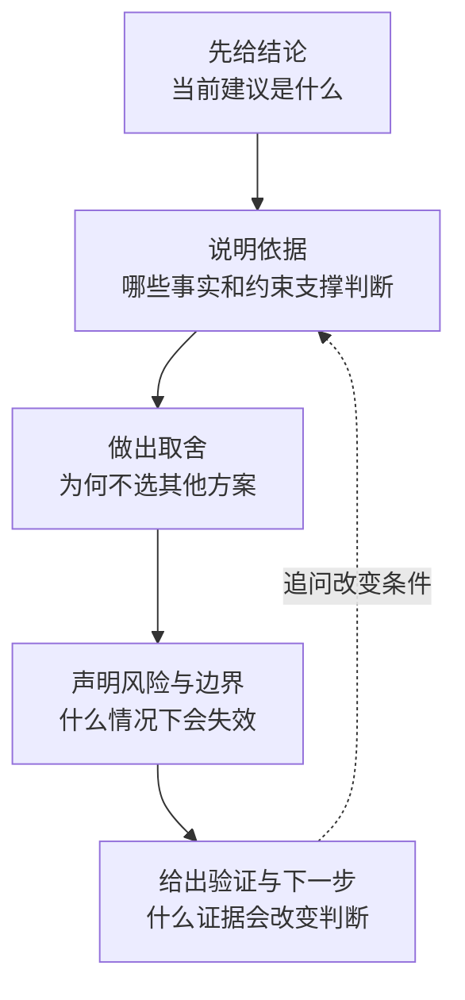

# 高频问题与推理式详解

> [!NOTE]
> **适合谁：** 需要按主题查漏补缺的人；不建议从 Q1 顺序背到 Q36 
> **使用方式：** 每次随机抽 3 题，回答 15 分钟，复盘 15 分钟 
> **完成后产出：** 三段限时回答、评分证据和两个待修问题

这不是“标准答案库”。每道题都说明考点、回答主线和边界。练习时先在规定时间内作答，再看详解；如果只背结论，面试官换一个约束就会失效。

| 主题                      | 问题范围 | 快速入口                         |
| ------------------------- | -------- | -------------------------------- |
| 岗位、发现与产品判断      | Q1—Q6    | [进入](#一岗位发现与产品判断)    |
| 编码、数据与系统设计      | Q7—Q13   | [进入](#二编码数据与系统设计)    |
| RAG、评测与模型变化       | Q14—Q19  | [进入](#三rag评测与模型变化)     |
| Agent、协议、可靠性与安全 | Q20—Q30  | [进入](#四agent协议可靠性与安全) |
| 沟通、行为与现场判断      | Q31—Q36  | [进入](#五沟通行为与现场判断)    |

如果你已经能回答但不知道质量差在哪里，直接使用[十二道核心题的答案校准](12-answer-calibration.md)，不要继续扩大题量。

## 使用方法

1. 随机抽题，不按章节顺序背；
2. 用 30 秒给结论，2—5 分钟展开；
3. 每个技术选择必须回答“为什么现在选它”；
4. 主动说出一个风险、一个验证和一个失效边界；
5. 让同伴连续追问三层；
6. 用评分表记录行为，不记录“像不像参考答案”。

每道题都尽量走完同一条证据链：

---

## 一、岗位、发现与产品判断

### Q1：你如何解释 FDE？它与解决方案架构师或普通软件工程师有什么不同？

**考点**：是否理解岗位的完整责任，而不是复述“技术 + 沟通”。

**回答主线**：FDE 对客户现场的可验证结果负责，并把现场学习反馈成可复用产品能力。它与软件工程师共享代码和系统深度，但更直接承担发现、范围、现场约束和采用；与解决方案架构师共享客户和架构能力，但通常更深入亲手构建、调试、上线和长期结果。

边界要说清：不同公司标题并不统一，不能把对比说成岗位高低。你还应结合目标职位描述说明是哪一种 FDE，以及自己的经历如何匹配。

**追问准备**：举一个你从表面需求找到真实问题，并最终改变产品或平台的例子。

### Q2：客户说“我们需要一个 Agent”，你第一步做什么？

**考点**：能否延迟解法，恢复真实工作流。

**回答主线**：先问 Agent 要改变哪段流程、谁使用、当前如何完成、哪一步需要动态判断、成功与失败代价是什么。再判断是否真的需要自治：如果步骤固定、规则清楚、风险高且结果难验证，确定性工作流或普通产品功能更合适。

不要当场否定客户。先理解“Agent”背后的诉求，可能是减少系统切换、自动补资料或缩短等待。给出可比较方案：规则/工作流、copilot 建议、受约束 Agent，并用价值、风险和验证成本选择。

**失效边界**：若客户已经完成严格发现且自治路径有成熟证据，就不需要从零质疑，但仍要核对权限、状态和验收。

### Q3：怎样把一个模糊需求变成两周可交付的 thin slice？

**考点**：范围管理与端到端意识。

**回答主线**：先锁定一个用户群、一个触发场景、一个高频或高价值决策和一个可量化结果。保留真实数据、真实权限和真实用户动作；降低功能广度和自治程度，用人工兜底。明确非目标、进入/退出条件和两周后要做的决策。

例如不是“缩小版全自动客服”，而是“只对低风险退款工单生成带来源建议，由客服确认发送”。它能验证数据、检索、建议质量、信任和时间节省，同时不承担自动退款风险。

**常见错误**：只做漂亮 UI 或固定 demo 输入，端到端最难部分仍然被推迟。

### Q4：客户要求 99% 准确率，你怎么回答？

**考点**：能否把抽象 SLA 转成错误分布和业务风险。

**回答主线**：先问准确率的对象、样本分布、错误类型和代价。99% 总体准确可能掩盖高风险场景全错；也可能是客户表达“某类错误不能发生”。把目标拆成任务成功、关键类别 recall/precision、权限违规、拒答和业务指标。

然后用分层方案降低风险：高置信低风险自动化，其他进入人工；对零容忍错误设置阻断门禁；建立代表性黄金集和线上反馈。不要承诺无法证明的数字，也不要只说“AI 不可能 100%”后停止推进。

**强信号**：把争论转成风险预算、验收样本和阶段化自治。

### Q5：如何衡量 FDE 项目成功？

**考点**：是否超越 demo 和模型指标。

**回答主线**：分三层。第一层是业务/工作流结果，如处理时长、损失、转化或积压；第二层是产品采用，如活跃、采纳、改写、绕过和培训；第三层是模型/系统控制指标，如任务成功、引用、权限、延迟和成本。

上线前记录基线和采集方式，避免只挑容易改善的样本。成功还应包含客户可运营和共性能力沉淀，否则一次项目可能有效但无法规模化。

**边界**：不同阶段权重不同。早期 thin slice 可能先证明可行性和风险，不能假装已经证明长期 ROI。

### Q6：客户的真实用户不愿使用你做的系统，怎么排查？

**考点**：是否把采用当作产品问题，而不是培训问题。

**回答主线**：先观察而不是只访谈。按用户、任务和阶段查看曝光、使用、采纳、修改、绕过和放弃；跟着用户完成一次真实流程。区分发现错误：没有解决最痛点、入口不在工作流、结果不可信、速度慢、增加责任风险、缺少关键数据，还是激励和权限阻碍。

修复优先从工作流与价值开始。可能需要更清楚引用、减少点击、先服务高频场景、显示不确定性、让人工更容易纠正，甚至承认项目选错。培训只能解决“不会用”，不能解决“不值得用”。

**强信号**：提出停掉或重定义低价值项目的条件。

---

## 二、编码、数据与系统设计

### Q7：FDE 编码面试和普通算法面试有什么不同？

**考点**：是否会准备正确的工程行为。

**回答主线**：形式可能完全相同，但 FDE 岗位常更看重在模糊输入下澄清、快速实现、测试、调试和解释权衡。有些公司仍会严格考 DSA，不能以岗位客户化为理由跳过基础。

准备应覆盖三类：算法熟练度、API/数据处理小项目、已有代码调试。现场保持契约—例子—方案—不变量—实现—测试—复杂度的稳定流程。

**边界**：不要声称某公司一定偏实际题；向 recruiter 确认当期格式。

### Q8：数据同步怎样做到幂等？

**考点**：是否理解“重试不会改变最终业务结果”。

**回答主线**：先定义业务身份和版本，而不是只靠消息 ID。每个变更有稳定对象键、来源版本/序号和事件 ID；消费者用原子 upsert 或条件写，拒绝旧版本覆盖新版本；外部副作用使用业务幂等键；checkpoint 只在处理和持久化成功后推进。

还要处理乱序、迟到、部分失败和回放。去重记录有保留策略；如果源不能提供顺序，周期快照对账补足增量流的遗漏。

**常见错误**：用进程内 `set` 去重，重启或多 Pod 后失效；或者先提交 offset 再写目标。

### Q9：为什么知识库需要软删除？什么时候可以物理删除？

**考点**：删除传播、审计和派生数据治理。

**回答主线**：源文档删除或失权时，查询路径必须尽快不可见，但文档可能已经产生 chunk、embedding、缓存和评测副本。软删除/tombstone 提供一个一致的逻辑状态，让所有读路径先排除，再异步清理派生数据，并保留短期审计/恢复能力。

物理删除在 tombstone 已传播、保留/合规要求满足、下游清理确认后执行。高敏感或法定删除可能要求更短窗口和可验证清除。软删除不是拖延删除的借口，必须有 deletion SLO、后台任务和对账。

### Q10：设计一个外部 API 调用层，要考虑什么？

**考点**：是否具备生产集成习惯。

**回答主线**：契约、认证授权、超时、重试分类、退避抖动、速率限制、熔断、幂等、分页、schema 演进、敏感日志、观测和 sandbox。对写操作区分请求是否接受、业务是否完成；遇到超时不能盲重试不可幂等动作。

在 Agent 场景还要限制工具作用域、参数、最大调用、审批和结果验证。工具返回内容是不可信输入，不应成为高优先级指令。

**强信号**：说明如何在依赖故障时降级，以及谁负责响应。

### Q11：如何设计多租户隔离？

**考点**：能否把租户作为贯穿全栈的不变量。

**回答主线**：身份层解析可信 tenant；数据模型、查询、缓存、索引、对象存储和队列都带租户作用域；授权在数据访问前强制；缓存键和连接池不能跨租户污染；后台任务继承明确租户上下文；日志与 trace 避免泄漏。

测试不仅是正向访问，还要用跨租户 canary、随机 tenant ID、缓存预热、异步任务和管理员边界做负向验证。对高风险客户可使用物理隔离或独立密钥，但要说明成本与运维权衡。

**常见错误**：先召回全局向量，再在模型输出阶段“过滤”。

### Q12：什么时候选 Postgres，什么时候选 Redis？

**考点**：是否按数据语义选择，而不是按性能标签。

**回答主线**：Postgres 适合需要持久事实、事务、约束、关系查询、审计和恢复的数据；Redis 适合可重建的低延迟缓存、短期协调、速率限制、临时会话和 pub/sub。Agent 项目中，任务真相、审批、工具副作用和审计通常不应只存在 Redis；短期流式事件、热点上下文和锁可以放 Redis。

关键问题不是谁更快，而是数据丢失能否接受、是否需要事务/查询、TTL、重建成本、并发语义和运营成熟度。也可以 Postgres 做 source of truth，Redis 做派生缓存。

**边界**：Redis 也有持久化和丰富数据结构，Postgres 也能做缓存；选择取决于部署和可靠性要求，不是绝对规则。

### Q13：系统设计里如何做容量估算，避免演数学题？

**考点**：估算能否驱动架构决策。

**回答主线**：只算会改变设计的量：峰值 QPS/并发、数据总量与增长、更新/删除率、消息大小、外部速率限制、模型延迟、保留期和可接受陈旧度。先声明假设，算数量级，再说明它影响分区、异步、缓存、批处理或限流的哪个决定。

例如长任务平均 30 秒、峰值 100 QPS，意味着同时运行约 3000 个任务，不能把状态放在 Web Pod 内存；需要队列、并发隔离和持久任务状态。

**常见错误**：计算精确到个位却没有任何架构结论。

---

## 三、RAG、评测与模型变化

### Q14：RAG 准确率从 90% 掉到 28%，怎样排查？

**考点**：能否做变更归因，而不是盲调 prompt。

**回答主线**：先确认指标、评测集、judge 和计算管道本身没有变化；核对下降时间与数据、解析、embedding、索引、权限、检索参数、prompt、模型和工具发布。按用户、意图、知识域、版本和风险分桶，找集中点。

对同一失败样本保存四份证据：源文档状态、候选检索、最终上下文、模型/工具 trace。正确文档没进上下文，就先修摄取/权限/检索；上下文正确但输出错，才看 prompt/模型；工具结果错则独立处理。用上一个已知良好版本做 replay 和二分。

处置上先控制影响：回滚、冻结发布、降级搜索或人工。恢复后补变更门禁和漂移监控。

### Q15：如何评测一个 RAG 系统？

**考点**：是否会分层并连接业务。

**回答主线**：建立代表真实分布和风险的黄金集，记录答案证据、角色、知识版本和允许拒答。分层测语料覆盖/新鲜度、检索 recall/MRR、权限正确、生成支持/引用、端到端任务成功和业务结果。

总体平均不能掩盖高风险错误；权限泄漏和关键政策错误应单独做阻断。离线评测用于快速回归，线上用用户行为、专家抽检、shadow 和失败回流补充。评测数据和 judge 都版本化。

**强信号**：说明怎样从事故、人工修改和低采纳场景持续扩充黄金集。

### Q16：反例样本怎样设计才算好？

**考点**：是否理解反例是验证边界，而不是故意刁难模型。

**回答主线**：每个反例针对明确不变量，有预期行为、风险等级和归因层。例如无答案问题应拒答、旧政策与新政策冲突应选当前版本、销售角色请求管理员文档应拒绝、文档中“忽略系统指令”不应改变 Agent 行为、重复写工具不应产生两次副作用。

反例来源优先是真实事故、红队和流程边界；生成式扩充后需要人工审阅。反例比例不应机械固定，要按风险覆盖。对少见但高损害场景可以过采样，报告时再按真实分布解释。

### Q17：LLM-as-a-judge 是否可信？

**考点**：能否把 judge 当测量仪器管理。

**回答主线**：它适合扩展语义评测和排序，但不是绝对真值。需要清楚 rubric、盲化无关信息、固定或记录 judge 版本、对顺序/长度/风格偏差做测试，并用人工标注集测一致性、精确率和召回。

高风险决策用确定性检查、专家复核或多方法交叉；线上趋势最好保持 judge 稳定，升级时双跑。若人类本身分歧大，先修标签定义，不应让 judge 掩盖问题。

**边界**：不要为了“更客观”盲目多 judge 投票；相关偏差不会因投票自动消失。

### Q18：文档每天变化，如何保证答案使用最新版本？

**考点**：同步、版本和读取一致性。

**回答主线**：源变化通过 CDC/事件/增量抓取进入版本化文档；解析、chunk、embedding 和索引都记录版本。新版本所有派生状态完成后再切换 active 指针；查询按有效时间和权限选版本。删除/撤回先 tombstone，缓存和索引遵循失效协议。

设置内容新鲜度、权限撤销和删除传播 SLO，周期快照与增量流对账。回答引用显示版本/生效时间，trace 记录本次使用的知识快照。对高风险政策可要求发布审批或双人审核。

### Q19：什么时候 fine-tuning，什么时候 RAG 或 prompt？

**考点**：能否按变化对象选择杠杆。

**回答主线**：prompt/示例适合调整任务说明和输出行为；RAG 适合需要新鲜、可引用、权限化外部知识；fine-tuning 适合稳定任务模式、风格、结构或专门能力，且有高质量训练与评测数据。它们可以组合。

如果问题是知识更新慢，fine-tuning 不是首选；如果正确上下文已有但模型长期无法遵循特定结构，才考虑训练。任何方案先用评测确认瓶颈，计算数据、上线、回滚和持续维护成本。

**常见错误**：把 fine-tuning 当作“让模型记住公司文档”。

---

## 四、Agent、协议、可靠性与安全

### Q20：Agent 让它做十件事，只完成五件，怎么办？

**考点**：任务分解、上下文、状态和验证，而非只改提示词。

**回答主线**：先确认是计划遗漏、执行失败、上下文丢失、工具失败、预算/步骤耗尽，还是错误认为已完成。把十件事从自然语言列表变成显式任务对象：ID、依赖、状态、完成证据、重试和 owner。每一步执行后由确定性检查或独立验证更新状态，未完成项重新规划。

减少一次塞入的上下文和工具；对互不依赖的任务并行，对长任务持久化；设置最大步骤、超时和人工升级。需要强顺序和全完成保证时，用 workflow engine 管理状态，模型只负责局部判断。

**强信号**：区分“模型注意力问题”和“系统没有任务账本”。

### Q21：自己的 Agent 适合用 Skill 来规定流程吗？

**考点**：能否区分程序性知识和强制执行机制。

**回答主线**：Skill 适合提供可复用说明、模板、参考和确定性脚本，通过渐进加载减少上下文；但它仍是给 Agent 的能力和指导，不是事务或安全保证。若流程必须严格顺序、可恢复、全量执行或涉及高风险副作用，应由状态机/工作流强制，Skill 负责局部方法。

从代表性任务评测开始，观察 Agent 哪些地方缺知识或工具，再增量写 Skill。定义触发条件、输入、产物、检查点和失败行为，并对 Skill 版本做回归。

### Q22：如何拆 sub-agent？

**考点**：是否有清晰拆分边界。

**回答主线**：只有在上下文、权限、工具、并行性、所有权或评测边界明显不同的时候拆。每个 sub-agent 有单一任务、最小工具、输入/输出契约、预算、终止条件和可验证产物；主 Agent 管理全局目标和合并。

不要让多个 Agent 共享所有上下文再互相评论，这只会增加成本和归因难度。默认由主 Agent 与用户交流；sub-agent 直接交流需要明确理由、身份、授权和状态同步。

**追问**：如何防止循环委派？使用深度/任务预算、任务 ID、父子关系和禁止重复委派规则。

### Q23：MCP 解决什么，不解决什么？

**考点**：是否超越协议名词。

**回答主线**：MCP 标准化 Agent 与工具/资源等能力的发现和调用，减少每个客户端重复做专有集成。它不自动解决 server 信任、用户身份、权限最小化、参数校验、工具副作用、供应链、业务幂等和结果正确性。

生产设计要回答授权 issuer/audience/scope、server 注册与版本、工具 allowlist、输出不可信处理、审计、撤销和故障隔离。2026 规范还引入无状态扩展和 Tasks 等变化，因此客户端/服务端兼容与弃用管理也是问题。

### Q24：MCP 与 A2A 有什么区别？

**考点**：能否按交互对象和生命周期选择协议。

**回答主线**：简化理解：MCP 更侧重 Agent/模型如何访问工具、资源和能力；A2A 更侧重独立 Agent 之间如何发现、交换消息、管理任务与产物。两者可组合：一个 Agent 通过 A2A 接受任务，内部用 MCP 调用企业工具。

但不是所有调用都需要协议。单进程模块用函数，稳定服务用普通 API 可能更简单。选择看组织边界、互操作需求、任务时长、身份和治理成本。

### Q25：用户关闭网页后，Agent 为什么还能继续？多 Pod 怎样断点续传？

**考点**：是否理解任务生命周期与连接解耦。

**回答主线**：创建请求先持久化任务并返回 `task_id`；后台 worker/工作流引擎执行，状态、事件和产物写入共享耐久存储。网页通过 SSE/WebSocket/polling 订阅；重开后携带 task ID 和最后事件序号继续。任何 API Pod 都能服务，不需要粘性会话。

必须处理 checkpoint、worker lease、幂等工具调用、取消、事件排序、输出保留、部署版本和权限复核。Redis 可用于短期事件和缓存，但任务真相与审计通常需要数据库或 durable workflow。

### Q26：Agent 工具调用如何防止重复扣款或重复发信？

**考点**：副作用与 exactly-once 幻觉。

**回答主线**：不承诺网络上的绝对 exactly-once，而用业务幂等实现“重复请求同一结果”。在计划阶段生成稳定 action ID/idempotency key；工具端原子记录请求与结果；重试先查询既有结果；审批绑定具体参数 hash；发送后状态持久化再推进工作流。

对不支持幂等的外部系统，使用 outbox、对账、补偿或人工确认。模型不能自行改变幂等键以绕过重复检测。

### Q27：如何防 Prompt Injection，尤其是 RAG 文档里的间接注入？

**考点**：是否知道仅靠提示词无法形成安全边界。

**回答主线**：把检索文档、网页、邮件和工具结果视为不可信数据，不允许其提升为系统指令；工具权限和参数由系统强制，使用最小权限、allowlist、审批、沙箱和预算；敏感数据按需提供；输出进入工具前做结构化验证。

建立对抗评测：恶意文档要求泄密/调用工具、编码混淆、多跳注入和工具结果注入。trace 记录来源和动作，但保护敏感正文。安全是多层控制，不是“在 system prompt 里写不要听文档”。

### Q28：Prompt cache 为什么更便宜？缓存在哪里？

**考点**：是否理解推理计算和产品边界。

**回答主线**：长提示的前缀需要模型做 prefill 并产生中间状态；相同或可复用前缀命中提供商管理缓存时，可以减少重复计算，因此延迟和计费更低。它通常是模型服务侧的短期、隔离缓存，不是把答案存进业务 Redis。

命中依赖前缀字节/结构稳定、模型与参数兼容、TTL 和提供商策略。设计时把稳定系统指令/工具放前面，动态用户内容放后面；监控 cache read/write token。不是所有提供商都提供，因为基础设施、调度、隐私隔离、命中率、模型架构和产品定价不同。

### Q29：Agent 可观测性应该记录什么？

**考点**：能否兼顾调试、成本和隐私。

**回答主线**：关联 request/task/trace；记录模型、提示、策略、知识和工具版本；每步状态、检索文档 ID/分数、工具选择与结果状态、终止原因、延迟、token、缓存、成本、评测和人工反馈。

默认不完整保存敏感 prompt、文档和工具参数。使用白名单字段、脱敏、采样、hash、访问控制和保留期。trace 要能回答“哪个版本、哪份证据、哪个动作导致结果”，同时不能成为新的数据泄漏面。

### Q30：模型供应商更新后行为变了，怎么办？

**考点**：模型作为外部依赖的变更治理。

**回答主线**：固定或记录精确模型版本；在升级前对黄金集、对抗集和关键 trace replay；新旧版本 shadow/A-B；按风险和用户分桶；设置质量、安全、延迟和成本门禁。保留快速回滚和 provider/model fallback，但 fallback 也要经过评测。

若供应商静默变更，线上漂移监控和 canary 会发现。事故后保存失败样本，更新契约和供应商沟通。不要只把温度调低；行为变化可能来自工具格式、推理、tokenization 或安全策略。

---

## 五、沟通、行为与现场判断

### Q31：客户要求你明天演示，但系统不稳定，怎么办？

**考点**：诚实、范围和现场恢复。

**回答主线**：先区分演示目标与生产承诺，向 sponsor 说明已知风险和可控选项。缩到稳定场景，冻结版本和输入范围，准备预录/静态结果作为透明兜底，设置 kill switch，并排练失败话术。不要伪造实时结果或隐藏限制。

演示后明确它证明了什么、没证明什么，以及进入试点需要的测试。若风险会泄密或造成不可逆动作，应拒绝 live 路径，给安全替代方案。

### Q32：如何对客户说“不”？

**考点**：是否能保护结果又不停止合作。

**回答主线**：先承认目标和紧迫性，具体说明限制带来的业务/安全后果，再提供更小、更快或更安全的替代路径和解除限制所需证据。

例如：

> 我理解你希望周五前全自动处理，以应对积压。当前我们还没有证明退款工具在重试下不会重复执行，也没有权限回归，因此我不建议开放全自动。周五前可以上线建议模式并由客服确认；同时用历史回放验证幂等和权限。达到零重复、零越权并通过 200 条高风险样本后，再对低金额场景灰度。

这是有条件的拒绝，不是把责任推给流程。

### Q33：讲一次失败，怎样避免说成包装后的成功？

**考点**：责任、真实性与机制学习。

**回答主线**：明确失败标准和实际影响，说明当时掌握的信息、你的决定及其中错误，不把原因全部推给客户或队友。讲清如何控制影响、沟通、恢复，以及后来改变了哪个系统机制。

真正的复盘应包含反事实：如果更早观察到什么会改变决策？哪些机制仍未解决？“以后加强沟通/更仔细”不是机制；发布门禁、owner、回滚、契约测试和监控才是。

### Q34：销售已经对客户承诺了不现实期限，你怎么处理？

**考点**：跨职能冲突和对外一致性。

**回答主线**：先内部快速澄清承诺、客户真实目标、最小可交付和风险；准备选项而不是只反对。与销售/负责人统一外部口径，向客户透明说明阶段、依赖和验收，不在客户面前互相甩锅。

如果安全或合规底线被触碰，明确升级并拒绝。项目后应把交付假设、技术发现和 go/no-go 条件前移到售前机制，避免重复。

### Q35：客户工程团队抵触你的方案，怎么办？

**考点**：能否识别信任和所有权问题。

**回答主线**：不要先假设他们抗拒变化。单独了解担忧：维护负担、失去控制、技术债、过去被绕过、指标冲突或方案确实不合适。邀请他们共同定义接口、运行责任和退出条件；用小实验验证争议；让知识转移和共同 ownership 从第一周开始。

如果对方提出有效反例，要愿意改方案。FDE 的目标不是赢得架构辩论，而是让系统进入客户能承担的生产状态。

### Q36：如何把一次客户定制变成产品能力？

**考点**：是否理解 FDE 的复利。

**回答主线**：把需求拆成客户特有配置、行业共性、跨行业原语。查看多个现场是否重复、差异是否可配置、平台边界是否稳定、维护成本和潜在采用。先沉淀契约、模板、connector、eval、policy 或 runbook，不必立即做成通用 UI。

向产品团队传递的不是“客户要功能 X”，而是问题频率、业务影响、现有 workaround、共同不变量、差异轴和验证证据。产品化也有边界：单一客户的特殊流程可能应留在交付层。

---

## 最后的训练要求

把这 36 题分成三组：

- **能用真实经历回答**：写入证据账本；
- **能做设计推演但没做过**：明确标为假设题；
- **暂时没有稳定结构**：进入七天 backlog。

每题不要追求和本页措辞一致。你真正要稳定的是：先定义问题，说明依据，给出控制，承认边界，并把当前修复变成长期机制。

---

[← 上一章：完整案例](07-casebook.md) · [答案校准](12-answer-calibration.md) · [下一章：行为与现场判断 →](09-behavioral.md)
