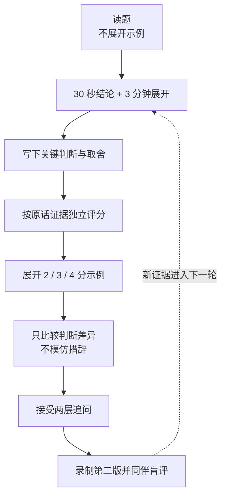

# 十二道核心题的答案校准

> [!NOTE]
> **适合谁：** 已经掌握基本概念，但回答容易正确而空泛、经不起追问的人 
> **使用方式：** 每次只练 1—2 题，每题先回答再展开示例 
> **完成后产出：** 一段第二版录像、一份原话证据评分和一条可复用的回答规则

问题库告诉你“这道题应该考虑什么”，校准包解决另一个更棘手的问题：为什么两段听起来都正确的回答，一段只能拿 2 分，另一段却能让面试官继续深入讨论。

这里没有公司内部标准答案。2 分、3 分和 4 分是本项目基于[总评分表](../../interview-kits/rubrics/master-scorecard.md)设计的训练锚点：

- **2 分：** 知道术语和常见做法，但判断依赖理想条件，尚不能稳定独立交付；
- **3 分：** 能定义问题、做出有边界的选择，并把方案推进到可验证的生产结果；
- **4 分：** 除了完成当前任务，还能管理组织与系统不确定性，把经验沉淀为团队或产品杠杆。

4 分回答不等于更长。它通常只是更早说明目标、更明确区分事实和假设、更敢于放弃错误问题，并能说出什么证据会让自己改变方案。

## 十二道题如何分组

| 训练组                                                   | 核心问题                                        | 主要观察维度                 |
| -------------------------------------------------------- | ----------------------------------------------- | ---------------------------- |
| [岗位与发现](calibration/01-role-discovery.md)           | FDE 是什么；客户要 Agent；如何切 thin slice     | 岗位判断、发现、范围控制     |
| [质量与数据](calibration/02-quality-data.md)             | 99% 准确率；RAG 暴跌；反例设计；upsert 与软删除 | 评测、诊断、数据生命周期     |
| [Agent 与分布式执行](calibration/03-agent-systems.md)    | 断点续传；十项任务只做五项；MCP 与 A2A          | 状态、可靠性、协议边界       |
| [现场领导力与产品化](calibration/04-field-leadership.md) | 明天演示但不稳定；客户定制如何产品化            | 风险沟通、交付判断、组织杠杆 |

## 正确训练顺序

第一次和第二次回答必须保留。只留下修改后的漂亮版本，会让你失去最重要的数据：自己究竟在哪个环节发生了变化。

## 三条使用纪律

### 先评分，后讨论

两位评审先独立打分，再交换意见。否则第二个人很容易被第一人的评价锚定。评分必须引用候选人的原话，不能用“感觉挺成熟”“听起来不错”代替证据。

### 只升一个等级

从 2 分到 3 分，先补齐独立交付所需的判断、边界和验证，不要急着模仿资深候选人的组织语言。没有真实证据支撑的 4 分表达，比朴素的 3 分回答更危险。

### 不背最终句子

示例中的公司、数据、指标和经历都是教学条件，不属于你。可以复用“先定义任务—再查现实—做最小闭环—上线学习—沉淀产品”的结构，但必须换成自己的事实。

## 完成标准

完成十二题不以阅读进度计算。你需要满足：

1. 每题能在 30 秒内给出带边界的结论；
2. 展开时至少做出一个明确取舍；
3. 能说出一个会改变当前判断的新证据；
4. 面对第二层追问仍然能回到任务、事实和风险；
5. 两位评审对大部分回答的评分差距不超过一个等级。

评审入口见[评审者校准指南](../../interview-kits/rubrics/reviewer-calibration.md)。两人训练时，应进一步使用[盲评、裁决与复评分离协议](../../interview-kits/rubrics/calibration-protocol.md)、[证据锚点库](../../interview-kits/rubrics/evidence-anchor-library.md)和[双评审记录模板](../../interview-kits/worksheets/reviewer-calibration-record.md)。如果分差较大，不要简单取平均，先判断是题目没有暴露某项能力、评分锚点不清，还是评审把表达流畅误当成了判断质量。

仓库还提供八个[机器可检验的合成校准场景](../../data/calibration-scenarios.json)。它们用于练习证据引用、`N/O`、一票否决和分歧分类，不是学员效果数据。真实双评审记录可以在移除身份、公司和真实题目后，用 `python3 scripts/summarize_calibration.py <ratings.json>` 汇总分歧；百分比必须和分母一起解释。

---

[← 上一章：作品集与项目叙事](11-portfolio.md) · [学习地图](reading-map.md) · [开始第一组：岗位与发现 →](calibration/01-role-discovery.md)
