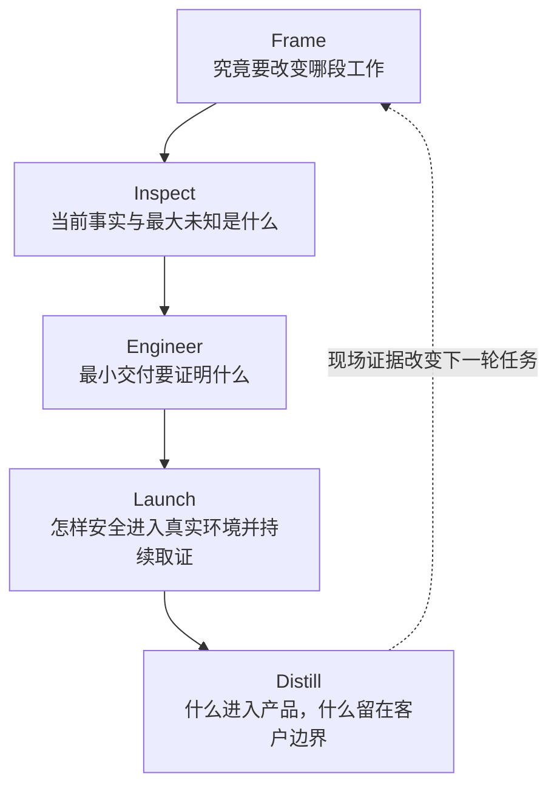
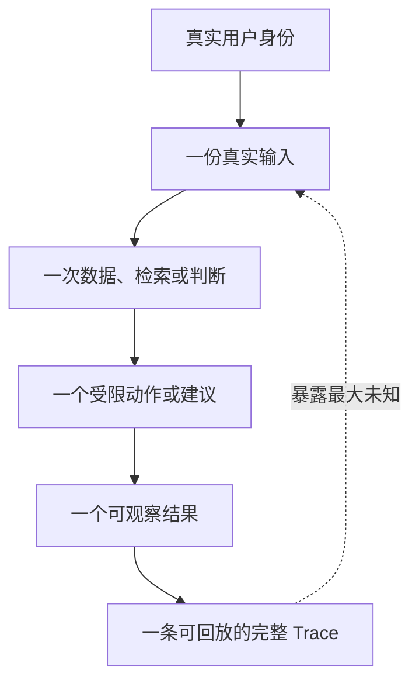

# 企业落地作战手册：从第一场会到可交接生产系统

> [!NOTE]
> **适合谁：** 想把面试中的方法真正带进企业现场，或需要证明自己不仅会答题的人<br>
> **首次通读：** 25 分钟；建议配合真实或自拟项目使用<br>
> **完成后产出：** 九份最小现场产物，以及一条从客户问题到产品反馈的证据链

FDE 面试中的发现、thin slice、系统设计、评测和产品化，不是五套分离的话术。进入企业后，它们会出现在同一个项目里，而且顺序经常被打乱：客户一边要求下周演示，一边还没有确定数据 owner；模型看起来能答，一线用户却不愿改变操作；安全团队在上线前才发现工具调用没有独立身份。

这章不提供“万能实施流程”。它给出一条最低限度的现场控制线：无论项目偏数据、AI、迁移还是行业应用，FDE 都应该持续回答五个问题。



## 1. 入场前：先写清责任，不要先约技术 Workshop

项目启动前最容易缺失的不是架构，而是决策权。销售认为目标是完成合同，业务 sponsor 期待指标改善，IT 团队担心维护，一线用户只希望别增加操作。每个人都在说“上线”，含义可能完全不同。

第一份产物应是一页 `engagement contract`：

| 项目     | 必须明确                                         |
| -------- | ------------------------------------------------ |
| Mission  | 要改变哪段工作流，为什么现在做                   |
| 决策人   | 谁能批准范围、数据、上线和停止                   |
| 使用者   | 谁每天实际操作，谁承担错误后果                   |
| FDE 责任 | 发现、设计、实现、集成、上线、培训分别负责什么   |
| 客户责任 | 数据 owner、系统接口、安全评审、业务验收由谁提供 |
| 证据     | 到哪个日期要拿到什么结果来决定下一步             |
| 非目标   | 本阶段明确不解决什么                             |
| 升级路径 | 阻塞超过多久找谁，什么风险必须立即上报           |

### 现场经验

不要把 RACI 表做成十页。真正要防的是“没有人能做决定”和“所有人以为别人负责”。如果一个关键事项出现两个 `Accountable`，它通常等于没有 owner。

## 2. 前 48 小时：拿证据，不急着证明自己

刚进入现场时，最危险的动作是为了建立专业形象，快速给出一套完整方案。客户提供的第一版叙述往往是组织视角，不是系统事实。

优先拿到六类证据：

1. **真实工作样本：** 三到十个最近发生的任务、工单、文档或失败案例；
2. **当前工作流：** 从触发到结果的实际步骤，包括等待、返工和线下动作；
3. **系统证据：** API、事件、日志、权限模型、错误码和数据样例；
4. **历史变化：** 最近三次发布、数据迁移、事故或组织调整；
5. **用户分层：** 高频用户、偶发用户、审批人、维护者和受错误影响的人；
6. **决策约束：** 期限、合规、预算、采购、数据驻留和不可逆动作。

### 第一次工作坊怎么开

不要从“你们想要哪些功能”开始。选一条最近完成或失败的真实任务，让参与者按时间复盘：

```text
什么触发了任务？
第一个输入从哪里来？
谁做了第一个判断，依据是什么？
信息不足时去哪里找？
哪个动作写入了外部系统？
失败后谁发现、谁恢复？
最终谁判断任务真的完成？
```

会议中出现争议是好事，它说明团队对当前流程并没有共同模型。不要当场强行统一答案，把争议记录为待验证假设，并指定证据和 owner。

## 3. 把会议纪要升级为“事实—假设—决策”系统

普通会议纪要记录谁说了什么，却很难支持下一次工程决策。FDE 更需要三个持续更新的账本。

### 事实账本

事实必须能指向来源，例如日志查询、数据样本、合同条款或用户操作记录。写“数据质量较差”不是事实；写“过去七天 18% 工单缺少产品版本，导致规则无法匹配”才是。

### 假设账本

每条假设包含：为何相信、如果错误会影响什么、最便宜的验证动作、负责人和截止时间。优先验证同时影响架构和项目价值的假设。

### 决策日志

记录当时选择、可用证据、放弃方案、代价、复审条件和 owner。决策日志不是为了追责，而是防止三周后团队用新信息倒推“当时早就应该知道”。

## 4. 定义 Mission：把“做系统”改写成“改变工作”

一个可执行 Mission 至少回答：

```text
谁在什么触发条件下，完成哪段工作？
今天的基线和主要代价是什么？
希望改变哪个可观察结果？
哪些错误不可接受？
本阶段要回答哪个决策？
```

例如，“建设企业知识 Agent”不是 Mission。下面的表达更接近可交付任务：

> 在六周内，让 A 区域 20 名一线支持人员在处理退款政策咨询时，能从当前有效且有权限的文档获得带引用建议；目标是降低查找时间和二次升级，同时任何跨租户引用、已撤销政策命中或无证据自动承诺都阻断扩大使用。第一阶段只做建议，不自动修改工单或退款。

这个 Mission 仍然可能变化，但它已经能驱动数据、权限、评测、界面和发布决策。

## 5. Thin slice：不是少做功能，而是尽快消灭最大未知

选择 thin slice 时，把未知分成四类：

| 未知   | 典型问题                             | 可用证据                       |
| ------ | ------------------------------------ | ------------------------------ |
| 价值   | 用户是否真的更快、更愿意采用         | 任务时间、采用、放弃、人工修正 |
| 可行性 | 数据、模型、系统能否达到最低能力     | 回放、端到端测试、容量和延迟   |
| 风险   | 权限、错误动作和合规能否受控         | 反例、红队、审计、故障注入     |
| 交付   | 客户组织是否能提供 owner、接口和运营 | 依赖完成率、响应时间、交接演练 |

好的 thin slice 会同时验证两到三个最大未知。只验证模型回答漂亮不够；只接完所有系统也不代表用户愿意采用。

### Thin slice 一页契约

- 目标用户和真实触发；
- 端到端输入、判断、动作与结果；
- 使用的真实数据、身份和权限；
- 人工介入和回退；
- 目标指标与阻断指标；
- 明确非目标；
- 依赖及 owner；
- 到期后扩大、修改或停止的条件。

## 6. 构建阶段：每天都要有可验证的纵向切片

现场项目很容易按技术层拆成“先做数据、再做后端、最后做前端”，直到最后一周才发现身份传递、权限过滤和真实工作流无法连接。

更稳妥的节奏是尽早跑通一条很窄的纵向路径：



随后再扩展数据量、用户、任务和自动化程度。每次扩展都对应新的评测和风险门槛。

### 每日技术同步只回答五件事

1. 昨天新增了哪条可运行证据？
2. 哪个假设被证实或推翻？
3. 当前最大阻塞由谁拥有？
4. 哪个风险正在扩大？
5. 今天结束前要完成哪个端到端状态？

“后端完成 80%”不是可运行证据。能用真实身份跑通一条请求、看到正确权限和 trace，才是。

## 7. 评测：不是给模型打分，而是控制变更

评测至少分四层：

### 组件层

检查解析、检索、重排、工具参数、权限过滤和数据同步等局部契约。

### 任务层

判断一次真实任务是否完成，包括答案证据、动作正确性、拒答和人工接管。

### 系统层

测延迟、容量、重试、幂等、恢复、成本、隔离和审计。

### 工作流层

测用户是否采用、任务时间是否下降、返工和升级是否减少，以及风险是否转移到别处。

每个发布候选都要绑定：代码版本、数据版本、Prompt/模型版本、工具契约、评测集版本和结果。否则“上周 90 分”与“本周 88 分”可能根本不是同一个实验。

## 8. 上线：先定义扩大和停止，不要只定义发布时间

一个最小发布计划包含：

| 项目     | 示例                                     |
| -------- | ---------------------------------------- |
| 发布单元 | 一个团队、一个地区、一个知识域或一种任务 |
| 进入条件 | 离线阻断项通过、owner 在线、回退演练完成 |
| 观察窗口 | 至少覆盖真实高峰和关键业务周期           |
| 扩大条件 | 质量、采用、延迟和人工负担达到门槛       |
| 停止条件 | 越权、错误副作用、删除未传播、无法恢复   |
| 回退方式 | 只读、建议模式、旧版本、人工流程         |
| 决策人   | 谁能扩大，谁能立即停止                   |

### 现场经验

“人工兜底”不是一句话。必须说明谁接管、从哪里看到待处理任务、接管时是否重复执行、值班时间和容量是否足够。没有经过演练的人工兜底，只是把技术风险转移给运营团队。

## 9. 事故：先控制影响，再证明根因

使用 TRACE：

| 阶段      | 事故现场的核心问题                       | 产物                                   |
| --------- | ---------------------------------------- | -------------------------------------- |
| Triage    | 影响谁、从何时开始、是否仍在扩大         | 影响范围、时间线、当前处置             |
| Reproduce | 能否固定请求、数据、版本和环境           | 最小复现与稳定对照                     |
| Attribute | 链路中第一个偏离点在哪里                 | 层级证据、已排除假设、候选根因         |
| Contain   | 哪种回滚、降级、隔离或接管能先控制影响   | 恢复动作、Owner、风险变化              |
| Evaluate  | 修复是否有效，机制怎样避免同类问题复发   | 回归样本、监控、门禁、Runbook 与复盘   |

事故群里需要一个统一记录者。所有新假设进入同一张表，不要多人同时修改生产并在聊天里报告“好像恢复了”。恢复服务与寻找根因可以并行，但必须由不同 owner 明确负责。

## 10. 采用：用户不用，不能简单归因于培训不足

采用问题至少检查五层：

1. **价值：** 系统是否解决用户真正痛点；
2. **流程：** 是否要求用户多开窗口、重复输入或承担新责任；
3. **信任：** 用户能否看见来源、限制和修正方式；
4. **激励：** 新系统节省的是谁的时间，增加的是谁的工作；
5. **运营：** 错误由谁处理，反馈是否真的进入迭代。

培训可以解决“不知道怎样用”，解决不了“不值得用”“不敢用”和“用了反而承担更多风险”。

## 11. 交接：交付完成的标志是客户能独立运营

至少完成以下交接：

- 系统 owner、数据 owner、业务 owner 和事故 owner；
- 日常监控、告警、值班和升级路径；
- 版本、配置、数据和权限变更流程；
- 常见故障、回退与恢复演练；
- 评测集维护和发布门禁；
- 成本预算和容量上限；
- 已知限制、技术债和复审日期；
- 临时账号、特殊权限和 FDE 手工步骤的退出。

如果系统只有原 FDE 知道怎样恢复，项目仍然处于个人英雄模式，没有真正进入生产运营。

## 12. 产品化：不是把客户代码复制到主仓库

维护 `field pattern log`，记录现场问题、证据、临时解、第二个出现位置和潜在 owner。一个模式可能进入四种去向：

1. 产品核心能力；
2. 受支持扩展点；
3. 行业或交付模板；
4. 明确保留为客户定制。

只有当问题重复、共同语义稳定、变化维度可管理且维护收益大于成本时，才值得进入产品。产品化成功要看新项目交付时间、采用、缺陷和支持成本是否改善，不看配置项增加了多少。

## 13. 面试回答如何映射到真实产物

| 面试中说的话      | 企业里必须拿出的东西                         |
| ----------------- | -------------------------------------------- |
| “我会先做发现”    | 当前工作流、事实/假设账本、问题陈述          |
| “先做 thin slice” | 一页契约、非目标、到期决策                   |
| “会做评测”        | evaluation contract、黄金集、阻断指标        |
| “会灰度上线”      | 发布单元、扩大/停止条件、回退演练            |
| “会做可观测性”    | 一条端到端 trace、版本指纹、告警 owner       |
| “会人工兜底”      | 接管队列、容量、权限、重复动作处理           |
| “会产品化”        | field-to-product memo、owner、迁移与退出计划 |

面试官继续追问这些产物时，如果你只能回到概念层，说明经验还没有形成可以迁移的工作方法。

## 14. 九份最小现场产物

本项目提供一份可直接复制的[现场交付模板包](../../interview-kits/worksheets/field-delivery-pack.md)：

1. Engagement Contract；
2. Current-state Workflow；
3. Facts / Assumptions / Decisions；
4. Thin-slice Contract；
5. Data and Tool Contract；
6. Evaluation and Release Contract；
7. Demo Readiness Card；
8. TRACE Incident Record；
9. Handoff and Field-to-Product Memo。

不要为了“流程完整”一次性填满所有模板。只在它能减少真实歧义、支持决策或保护生产时使用。FDE 的成熟不是文档更多，而是在正确时间留下足够证据，让团队不用依赖某个人的记忆继续工作。

---

[← 答案校准](12-answer-calibration.md) · [现场交付模板包](../../interview-kits/worksheets/field-delivery-pack.md) · [下一章：岗位定向 →](14-job-targeting.md)
