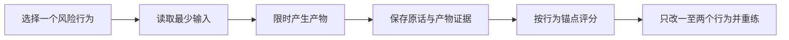

# 第十五章：从阅读转向刻意训练

> **适合谁：** 已经知道 FDE 大致做什么，但面对完整仓库仍不知道今天应该练什么的人<br>
> **本章时间：** 20 分钟；随后选择一条 7、14 或 30 天路径<br>
> **读完产物：** 一条训练路径、两个高风险行为和第一次训练的日程

## 1. 资料多，不等于准备充分

面试准备最常见的假进展，是不断阅读、收藏和修改笔记。它会带来熟悉感，却没有证明你能在时间压力下界定问题、做出取舍、更新判断并留下可运营方案。

本项目从 v0.6 开始把阅读材料和训练协议分开：

- 章节负责解释概念、方法和边界；
- 路径规定一段时间内应该完成哪些 session；
- 每个 session 必须产生可检查产物；
- 完成规则判断行为是否出现，而不是判断页面是否读完；
- 日志记录第一次表现、修复动作和第二次证据。

机器可读的正式路径在 [`data/learning-paths.json`](../../data/learning-paths.json)。这份 JSON 不是为了让学员阅读，而是防止导航、练习文件和完成门槛在后续版本中悄悄失配。

## 2. 只选一条主路径

| 你的现实约束 | 选择 | 最小完成证据 |
| --- | --- | --- |
| 一周内面试，时间非常有限 | 七天面试冲刺 | 一个项目主线、一页系统设计、一次盲练与一次定点重练 |
| 已有明确 JD，需要针对性准备 | 十四天岗位定向训练 | 岗位简报、D/A/E/G 矩阵、角色专项产物、角色盲练与修复 |
| 想建立能进入真实项目的基础 | 三十天现场交付基础训练 | 可运行薄切片、生产契约、两套案例、最终作品集证据图 |

不要同时运行三条路径。路径不是越多越专业；真正的训练需要重复、评分和修复，而这些都消耗注意力。

## 3. 一次 session 的正确结构

一次有效 session 有六个步骤：



### 选择风险行为

风险必须能被观察。例如“不会系统设计”过于宽泛；“没有确认当前基线就给出技术架构”可以观察，也可以替换。

### 读取最少输入

每个 session 的 `inputs` 是完成任务所需的最少材料，不是新的阅读清单。已经掌握就直接开始练，不必为了打卡重读。

### 产生产物

产物可以是录像、代码、测试、架构图、角色简报、评分表或事故时间线。只有观点没有产物，很难区分“我理解了”和“我能做到”。

### 保存证据

保留原话、白板位置、代码 diff 或测试输出。不要用“表现不错”“思路正确”替代证据。

### 评分与修复

评分必须引用行为证据。第二次只修一至两个最低项；同时改结构、知识、措辞和案例，会让你无法知道什么真正起作用。

完整记录使用[刻意训练日志](../../interview-kits/worksheets/practice-journal.md)。

## 4. 三条路径怎样运行

### 七天面试冲刺

七个 session 原则上每天一个，顺序不建议打乱：

```text
风险基线
-> 项目主线
-> 客户发现
-> 工作流系统设计
-> 生产 AI 边界
-> 盲练
-> 定点修复
```

第六天必须盲练。若没有同伴，可录像后隔数小时再按评分表自评，但必须把它标记为“自评”，不能写成独立验证。

### 十四天岗位定向训练

十个 session 可以在十四天内安排四个恢复或补做日。前三次先完成岗位事实、证据等级和角色选择；在此之前不要急着修改简历关键词。

角色专项练习只选一条主路径。AI/Agent、数据平台和受监管部署有重叠，但面试准备需要明确主证据，否则每个方向都只停在术语层。

### 三十天现场交付基础训练

十二个 session 按每两至三天一个安排。技术薄切片、评测契约、数据生命周期、威胁模型、事故、采用和产品沉淀必须留下不同产物，不能用同一张架构图证明所有能力。

第十一项要求运行两套盲案例，至少一套是事故类。计划型案例观察你如何设计；事故型案例观察证据不完整时怎样保护用户并更新判断，两者不能相互替代。

## 5. 一个人训练怎么办

没有同伴时仍可以完成 A1 级训练：

1. 先锁定时间盒，开始后不再打开复盘或参考答案；
2. 录屏并口述假设、选择和改变决定的证据；
3. 结束后离开材料至少三十分钟；
4. 使用评分表引用原话，不凭印象评分；
5. 将评分者标记为自己，并写明信心；
6. 有同伴后优先复核一票否决项和最低两项。

自练可以建立行为，但不能证明评审一致性。项目不会把自评分数包装成独立试用结果。

## 6. 同伴或老师怎样主持

主持人的任务不是教答案，而是保证证据按协议释放：

- 候选人没有问到的未知项不要主动念完；
- 有效提问不要求命中术语；
- 新证据可以推翻候选人的旧方案；
- 评分引用原话和产物，不评价人格；
- 复盘只选择两个最值得改变的行为；
- 如果必须靠作者口头解释才能运行，记录为材料缺陷。

案例主持细则见[案例包运行标准](../../interview-kits/cases/facilitation-standard.md)，角色定向盲练见[匿名试用协议](../../interview-kits/mock-loops/role-targeted/pilot-protocol.md)。

## 7. 怎样判断一条路径完成

路径完成不是 session 数量打满，而是 `exit_evidence` 存在。最低检查包括：

- 每个 session 有真实产物；
- 完成规则可以用原话、文件或测试判断；
- 至少一次训练经过评分；
- 至少一个低分行为经过第二次尝试；
- D/A/E/G 边界没有因为包装而升级；
- 未改善、缺人主持和仍需作者解释的地方被保留。

这些证据只能说明训练按协议发生，不能推出面试录取、就业或薪酬结果。

## 8. 今天就开始

1. 在上面的表中选择一条路径；
2. 复制一份[刻意训练日志](../../interview-kits/worksheets/practice-journal.md)；
3. 写下两个最高风险行为；
4. 在日历中锁定前三个 session；
5. 完成第一个产物以后再继续阅读。

真正的进步通常不是又理解了一个名词，而是下一次面对相同触发条件时，做出了不同且更可验证的动作。

---

[上一章：岗位定向](14-job-targeting.md) · [返回学习地图](reading-map.md) · [刻意训练日志](../../interview-kits/worksheets/practice-journal.md)
