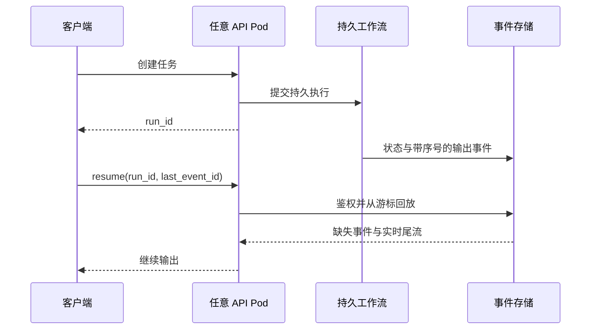

# 答案校准三：Agent、状态与分布式执行

> [!TIP]
> 这一组不要从框架名字开始。先画状态归谁、动作怎样幂等、客户端断开后谁继续工作，再讨论协议和组件。

## Q8：用户关闭页面后，Agent 为什么还能继续？多 Pod 怎样断点续传？

### 面试官在观察什么

问题表面是流式输出，实质是执行生命周期是否依赖某条 HTTP 连接和某个 Pod。高分回答要把“任务继续执行”“结果可靠保存”“客户端恢复观看”三个问题分开。

<strong>2 分回答：依赖粘性会话或共享缓存</strong>

> 可以用 sticky session 把用户重新路由到原来的 Pod，或者把输出放进 Redis，用户重连后继续读取。

这能解决部分演示场景，却没有回答原 Pod 挂掉怎么办、任务状态在哪里、Redis 里的内容是否可重放，以及工具动作是否可能重复执行。

<strong>3 分回答：把执行与连接解耦</strong>

> API 收到请求后先创建稳定的 `run_id`，把任务交给队列或工作流执行器，Pod 只负责建立连接，不拥有任务。Worker 产生的状态变化和输出片段写入可持久化事件流。浏览器通过 SSE 或 WebSocket 订阅 `run_id`，断线后携带最后确认的事件序号重连，任何 Pod 都能鉴权并从该位置继续发送。最终状态和关键结果进入数据库，短期热事件可以放在消息系统或 Redis，但不能只存在进程内存。

这段回答已经消除了“必须回到原 Pod”的约束，并给出重放位置。

<strong>4 分回答：补齐持久状态、幂等、副作用和治理</strong>

> 我会先定义任务状态机，例如 queued、running、waiting_for_tool、waiting_for_human、completed、failed、cancelled。每次状态迁移和输出事件都有单调序号，客户端的光标只影响展示，不影响执行。Worker 通过租约领取任务，租约失效可以接管；工具调用必须带幂等键，不能把“任务只执行一次”建立在消息系统绝不重复的假设上。重连接口还要重新做租户和用户授权，限制历史事件保留、单用户并发和慢消费者。对于需要等待几小时、人工审批或跨服务重试的任务，使用 durable workflow；对于几十秒的只读生成，不必引入同样复杂度。

4 分回答说明了状态、交付语义、安全和适用边界，也没有把某个中间件当成答案。

### 白板上至少画出四条线

再单独画工具副作用：`run_id + step_id + attempt` 如何生成幂等键，工具成功但确认丢失时怎样查询和恢复。

### 落到企业现场

上线前演练浏览器关闭、API Pod 重启、Worker 处理中断、同一消息重复投递、工具成功后网络超时、用户撤销权限和客户端慢消费。只有“断线后文字还能继续显示”并不等于任务可恢复。

## Q9：让 Agent 做十件事，它只完成五件，怎么办？

### 面试官在观察什么

这不是简单的“注意力不够”。任务可能没有被显式表示、完成标准不清、上下文被挤出、工具失败被吞掉、循环提前停止，或者十件事本来就不该交给一个自由 Agent。高分回答先诊断失败类型，再选择控制方式。

<strong>2 分回答：继续强化 Prompt</strong>

> 我会在 Prompt 里强调必须完成全部十项，要求 Agent 先列计划、逐项打勾，并增加最大循环次数。

计划和清单可能有帮助，但如果状态只在上下文里、工具结果没有契约、任务依赖错误，增加循环只会提高成本和重复动作风险。

<strong>3 分回答：显式任务状态加验证器</strong>

> 我会先回放 trace，判断五项是没规划、规划后遗漏、工具失败、验证失败还是被停止条件截断。然后把十项任务外置成结构化状态，每项有输入、依赖、完成条件、允许工具、重试和失败状态。Agent 每轮只领取当前可执行项，执行后由确定性检查或独立 verifier 更新状态；最终完成由任务表判断，不由模型一句“全部完成”判断。没有完成的项必须显式返回原因。

这段回答把任务真相从模型上下文移到了可检查状态，也区分了执行和验证。

<strong>4 分回答：重新判断哪些步骤需要 Agent</strong>

> 我会先做失败分类，而不是直接换更强模型。如果十项任务固定且依赖清楚，应该用工作流编排，模型只负责其中需要语义判断的节点；如果任务需要根据中间证据动态分解，才让 Agent 规划。长任务采用层级计划：主任务只保留目标、约束和进度，子任务拥有局部上下文和预算。每项任务都定义可验证产物，副作用通过审批和幂等执行。监控计划覆盖率、步骤成功率、验证失败、重复动作、上下文增长和停止原因。最终优化目标不是“让模型坚持更久”，而是让遗漏能够被发现、恢复和归因。

4 分回答对系统边界做了重构：固定流程交还确定性编排，自治只保留在真正需要的地方。

### 一张有用的失败分类表

| 失败位置     | 可观察证据                 | 优先修复                         |
| ------------ | -------------------------- | -------------------------------- |
| 规划遗漏     | 初始计划没有该项           | 任务枚举、依赖和完成契约         |
| 上下文遗忘   | 早期有计划，后期不再出现   | 外置状态、上下文压缩、局部子任务 |
| 工具失败     | trace 有错误但任务被标完成 | 工具契约、错误传播、验证器       |
| 循环提前停止 | 达到 token、轮次或时间预算 | 预算分配、检查点、可恢复执行     |
| 重复执行     | 同一步骤多次产生副作用     | 幂等键、状态迁移和租约           |
| 错误完成     | 模型声明完成但产物缺失     | 以产物验证代替自我声明           |

### 落到企业现场

要求团队提供一条失败 run 的完整 trace，不要只看最终对话。复盘时给每个遗漏标注“计划、上下文、工具、验证、状态、预算”中的一个主因；连续十次失败如果仍然只能归因于“模型不稳定”，说明可观测性还没有做到可工程化。

## Q10：MCP 与 A2A 有什么区别，什么时候该用？

### 面试官在观察什么

面试官通常不期待背协议字段，而是看你能否区分“Agent 如何使用外部能力”和“两个独立 Agent 如何协作完成任务”，并判断是否真的需要新增协议边界。

<strong>2 分回答：给出一句话标签</strong>

> MCP 是 Agent 调工具，A2A 是 Agent 和 Agent 通信。两者可以结合使用。

这句话方向正确，却无法支持架构决策。它没有说明状态、发现、授权、任务生命周期和何时根本不需要 A2A。

<strong>3 分回答：用责任对象区分协议</strong>

> MCP 主要在模型应用和能力提供方之间提供标准化边界，让客户端发现并调用工具、读取资源或使用提示模板；任务编排通常仍由客户端控制。A2A 面向独立 Agent 之间的协作，重点是能力发现、消息、长任务状态、流式更新和异步结果。一个采购 Agent 可以通过 A2A 委托合规 Agent 审查供应商，而合规 Agent 内部再通过 MCP 调用政策检索和审计工具。若只是同一服务里的两个函数或固定步骤，用普通 API 和工作流更简单。

这段回答给出了组合方式，也明确协议不是默认选择。

<strong>4 分回答：从信任域和运维责任决定边界</strong>

> 我先看双方是否属于不同所有者、部署域和生命周期。如果只是一个团队控制的内部模块，不需要为了“多 Agent”引入 A2A。只有当对方是可独立升级、独立授权、可能长时间运行的能力主体时，Agent-to-Agent 任务边界才有价值。MCP 也不自动解决权限：调用方身份如何传播、工具参数怎样校验、返回内容能否进入模型上下文、日志是否泄露，都要单独设计。实际架构中我会写清每条边界的 owner、身份、任务状态、超时、取消、幂等、审计和降级，再决定使用协议还是普通接口。

4 分回答没有停在协议功能，而是把协议选择连接到组织所有权、信任域和运营成本。

### 面试现场的判断顺序

1. 这是函数、工具、固定工作流，还是独立任务主体？
2. 谁拥有它，是否可以独立部署和升级？
3. 调用持续毫秒、秒，还是需要异步等待？
4. 状态、取消、授权和审计由谁负责？
5. 普通 API 是否已经足够？

### 落到企业现场

交付一张 `protocol boundary matrix`，每行是一条跨系统调用，列出调用方、能力方、身份、数据分类、状态 owner、超时、重试、幂等、取消、审计和降级。协议名称放在最后一列。这样能避免团队先选 MCP/A2A，再倒推一个使用理由。

---

[← 上一组：质量与数据](02-quality-data.md) · [校准包首页](../12-answer-calibration.md) · [下一组：现场领导力与产品化 →](04-field-leadership.md)
