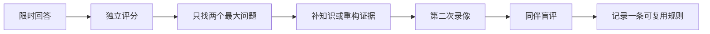

# 学习地图：不用从第一页读到最后一页

> [!NOTE]
> **适合谁：** 第一次进入项目，或者已经收藏了很多资料却不知道先练什么的人<br>
> **首次使用：** 10 分钟<br>
> **完成后产出：** 一条符合你背景和面试时间的阅读路径，以及不超过三个训练任务

这套 Fieldbook 不是一本需要顺序通读的教材。FDE 涉及客户、产品、代码、数据、系统、AI、上线和沟通，如果按照目录平均用力，很容易形成“每个词都见过，但遇到追问说不深”的假熟练。

正确用法是先确定目标岗位和当前短板，再选择最短路径。读一章不是为了打卡，而是为了留下一个能被观察、评分或复盘的产物。

## 先做三分钟分流

只回答下面三个问题：

1. 你的目标职位更偏 AI 应用、数据平台、全栈交付，还是行业解决方案？
2. 你距离面试还有一天、一周，还是一个月以上？
3. 你最担心的是不会做、不会讲，还是经不起追问？

如果第一个问题答不出来，先读[岗位地图](01-role-map.md)。如果第二个问题是“一天”，不要再补完整知识体系，只做一次限时回答、评分和纠偏。如果第三个问题答不出来，先用[总评分表](../../interview-kits/rubrics/master-scorecard.md)做基线。

## 按你的背景选择路径

### 软件工程师转 FDE

你的优势通常是编码和系统边界，风险是把客户问题过早翻译成技术任务。

```text
岗位地图 -> 客户发现 -> 行为与现场判断 -> 完整案例 -> 答案校准
```

建议产物：一张当前工作流、一份利益相关者地图、一次“拒绝不合理需求”的录像回答。

### 数据工程师转 AI FDE

你的优势是数据质量、幂等、血缘和可恢复性，风险是只讲管道，不讲用户采用与模型行为。

```text
岗位地图 -> 生产 AI -> 系统设计 -> 客户发现 -> 案例一与案例三
```

建议产物：一条从源数据到答案引用的证据链，以及一份知识库更新和删除设计。

### AI 应用工程师转 FDE

你的优势是模型、RAG 和 Agent，风险是默认用 AI、只展示 Demo、不说明谁承担错误。

```text
客户发现 -> 系统设计 -> 生产 AI -> 受监管 Agent 案例 -> 行为面
```

建议产物：一份“为什么不用 Agent”的反方论证，以及一套上线门禁和人工接管条件。

### 解决方案架构师、售前或咨询顾问转 FDE

你的优势是沟通和方案表达，风险是缺少亲手实现、调试和生产责任证据。

```text
编码与数据 -> 系统设计 -> 生产事故 TRACE -> 完整案例 -> 作品集
```

建议产物：一个可以运行和测试的最小切片、一份故障复盘，以及清楚标注个人贡献的项目故事。

### 已经在做 FDE，希望冲击资深岗位

不要继续证明“我能把项目做完”，而要证明你能管理多个系统和组织边界，并把现场经验变成产品杠杆。

```text
岗位地图的级别差异 -> 系统设计 -> 产品化 -> 答案校准 -> 评审别人
```

建议产物：一个从客户现场进入产品路线的真实反馈闭环，以及一次对他人答案的证据式评分。

## 按剩余时间选择路径

| 剩余时间 | 不要做什么                     | 只做什么                                   | 最终产物                            |
| -------- | ------------------------------ | ------------------------------------------ | ----------------------------------- |
| 24 小时  | 通读所有章节、临时编造项目数字 | 核对岗位、准备两个项目故事、完成一次模拟   | 90 秒定位 + 两个可信故事 + 三个反问 |
| 7 天     | 每天换一套题库                 | 执行[七天冲刺](10-study-plans.md#七天冲刺) | 一次完整录像、一次盲评、一页复盘    |
| 30 天    | 平均补齐所有知识点             | 只修三个高风险短板                         | 三轮模拟、两个案例、一个作品集主线  |
| 尚未投递 | 用阅读代替交付                 | 建立证据账本并完成最小作品                 | 可以演示、追问和复盘的证据          |

## 按问题选择入口

| 你的症状 | 先读 | 然后做 |
| --- | --- | --- |
| 一开口就画架构 | [客户发现](03-discovery.md) | 十分钟内只提问，不给方案 |
| 系统设计像背云服务清单 | [系统设计](05-system-design.md) | 同时画数据流、控制流和证据流 |
| RAG/Agent 会做但不会排障 | [生产 AI](06-production-ai.md) | 用分层回放定位一次指标下降 |
| 案例读懂了但现场不会应变 | [Field Case Lab](../../interview-kits/cases/README.md) | 让同伴按轮放证据并记录判断变化 |
| 项目很多但讲不出个人价值 | [行为面](09-behavioral.md)与[作品集](11-portfolio.md) | 重写一个失败故事和一个产品化故事 |
| 回答听起来正确但没有层次 | [答案校准](12-answer-calibration.md) | 对照 2/3/4 分答案录制第二版 |
| 已有具体 JD 但仍在平均补课 | [岗位定向](14-job-targeting.md) | 一页岗位简报、证据矩阵和十次训练 |
| 不知道自己准备得够不够 | [总评分表](../../interview-kits/rubrics/master-scorecard.md) | 让同伴只按原话证据评分 |

## 一次完整学习循环



阅读只发生在 `C -> D`。如果没有第一次回答、评分和第二次输出，你只是获得了“看懂”的感觉，没有形成面试能力。

## 如何使用折叠答案

答案校准页会默认展示题目、观察维度和评分区别，把完整示例放在折叠区。建议先回答再展开：

1. 限时回答，不打开示例；
2. 写下你认为自己的分数和证据；
3. 依次展开 2 分、3 分、4 分回答；
4. 只抄结构，不抄句子；
5. 重新录制，并让同伴盲评。

如果直接背 4 分回答，你会得到一段语言成熟、但经不起追问的话术。校准的目的不是统一说法，而是统一对“什么叫有证据的判断”的理解。

## 什么时候考虑文档站

当前阶段保留 GitHub Markdown 作为唯一内容源，原因是链接可审查、版本可追踪、贡献门槛低，也方便读者下载离线阅读。等章节结构和双语范围稳定后，可以由同一套 Markdown 自动生成带侧边栏、全文搜索、移动端导航和深浅色模式的静态文档站。

文档站只是阅读界面，不会替代仓库，也不会引入登录、数据库、用户画像或另一套内容。这样可以改善阅读体验，同时避免把一个内容项目变成需要长期维护的软件产品。

---

[开始第一章：FDE 到底负责什么 →](01-role-map.md)
