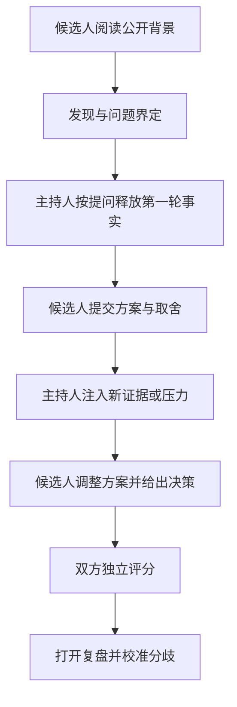

# FDE Field Case Lab

这里不是“看完答案觉得自己会了”的案例文章，而是一套可以由同伴、教练或面试官直接主持的训练包。每套案例都把候选人材料、主持人信息、分轮证据、专项评分和复盘分开，尽量还原现场交付中的信息不完整、目标冲突和新证据出现。

## 先选择案例

| 案例 | 核心能力 | 建议时长 | 适合岗位 |
| --- | --- | ---: | --- |
| [经典数据平台迁移](data-platform-migration/README.md) | 数据语义、CDC、对账、切换与回滚 | 75 分钟 | 数据 FDE、平台 FDE、解决方案工程师 |
| [隔离环境 AI 部署](air-gapped-ai-deployment/README.md) | 约束发现、供应链、安全、离线评测与运维 | 75 分钟 | AI FDE、政企交付、安全解决方案 |
| [生产事故指挥](production-incident/README.md) | 止血、分层归因、幂等、指标可信度与复盘 | 60 分钟 | AI FDE、生产工程、技术负责人 |
| [Agent 工具副作用失控](agent-tool-side-effect/README.md) | 不可逆动作、权限、幂等、未知结果与财务事故 | 75 分钟 | Agent FDE、应用工程、平台工程 |
| [知识库同步与删除边界](knowledge-sync-lifecycle/README.md) | 稳定身份、权限撤回、软删除、快照与对账 | 75 分钟 | 数据 FDE、RAG 平台、搜索工程 |
| [多 Pod 长任务与断点续传](durable-agent-streaming/README.md) | 持久任务、租约、事件游标、恢复与取消 | 75 分钟 | Agent FDE、分布式系统、平台工程 |
| [AI 评测指标断崖式回归](evaluation-regression/README.md) | 指标可信度、版本矩阵、切片保护与归因实验 | 75 分钟 | AI FDE、评测平台、生产工程 |
| [跨境企业 AI 部署](cross-border-ai-deployment/README.md) | 数据分类、区域边界、供应商控制与阶段交付 | 90 分钟 | 行业 FDE、安全方案、跨境交付 |
| [技术正确但没人使用](adoption-rescue/README.md) | 工作流采用、信任、分群实验与产品反馈 | 75 分钟 | 全类型 FDE、产品工程、解决方案 |
| [连接器从定制走向产品能力](connector-productization/README.md) | 契约、适配、版本、运营、迁移与复用边界 | 75 分钟 | 数据 FDE、平台 FDE、技术负责人 |

第一次训练只打开案例目录里的 `candidate-brief.md`。面试官材料、证据文件和复盘都包含剧透，应由主持人按轮次释放。

## 一次训练怎样运行

推荐由一名候选人、一名主持人和一名可选观察员完成。观察员只记录原话、决策和时间，不中途提示。双方必须在阅读参考复盘前独立评分，否则评分会被答案锚定。

完整主持规则见[案例包运行标准](facilitation-standard.md)。案例文件契约记录在 [`data/case-packs.json`](../../data/case-packs.json)，并由 `python3 scripts/validate_case_packs.py` 自动检查。

## 十套案例怎样组合

不要按目录顺序刷完。先选一套与你目标岗位最接近的计划型案例，再选一套会打断原计划的事故或压力案例：

- **AI / Agent 主线：** Agent 工具副作用 + 评测回归或长任务恢复；
- **数据平台主线：** 数据迁移 + 知识生命周期或连接器产品化；
- **受监管与行业交付：** 隔离部署 + 跨境部署或生产事故；
- **资深 FDE 主线：** 采用恢复 + 连接器产品化，再补一套事故；
- **综合基线：** 数据迁移 + 生产事故，覆盖计划与响应两类判断。

`data/case-packs.json` 还记录难度、风险域、FIELD 能力、案例特有发布门禁和真实主持状态。当前十套案例均已通过 A1 自动化契约，但 `human_validation.status` 仍是 `not-run`：这表示内容结构已经可检查，不表示已经由独立主持人验证。

## 三种练法

### 个人练习

只看候选人材料，录制自己的提问和方案。完成后按专项评分表自评，再打开证据和复盘。个人练习不能检验追问质量，但可以暴露“未获取证据就下结论”的习惯。

### 双人模拟

主持人严格按手册释放信息。候选人如果没有问到某类信息，主持人不主动投喂答案；但只要问题方向正确，就不应用猜词游戏阻止其获得事实。

### 三人校准

增加一名观察员，主持人和观察员分别评分。若任何维度相差超过一级，双方必须引用候选人的原话解释，不得用“感觉更资深”作为理由。

## 训练记录

每次只留下四项：

1. 候选人最早识别出的关键不确定性；
2. 一个有证据的好决定；
3. 一个会放大生产风险的决定；
4. 下一次只改变的两个行为。

案例不是为了找唯一架构，而是观察候选人如何在新证据出现后修正判断。换方案不扣分；没有证据仍坚持原方案，才是风险。
