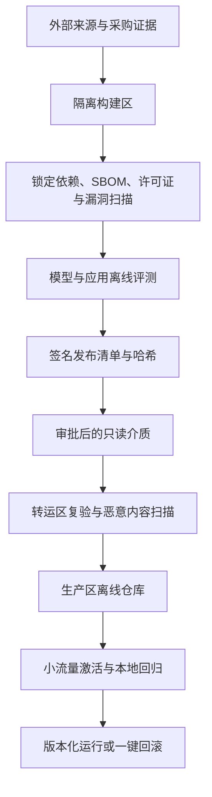

# 参考复盘：隔离环境 AI 部署

隔离环境不会让风险自动消失，只会改变风险进入、被发现和被修复的方式。复盘应同时讨论能否上线和上线后谁能长期维护。

## 关键判断

### Air gap是一套运营模型

“不联网”只说明某条网络路径不存在。模型、镜像、依赖、文档和补丁仍会通过人和介质进入，日志和备份仍会在内部流动。真正的控制面是：什么可以跨域、由谁批准、如何证明没有被替换、进入后怎样撤销。

### 哈希解决完整性，不解决可信性

SHA-256可以证明接收文件是否与给定文件相同，但如果给定文件本身来源不清、许可证不明或已经带风险，哈希不会把它变安全。还需要来源、签名、许可证、模型卡或行为边界、组件清单、漏洞扫描、评测和批准记录。

### 总体平均分会掩盖不可接受的长尾

普通规程表现很好，不能抵消受限标题泄漏、撤回版本引用或无依据回答。上线授权应按风险切片设门禁，高严重度事件即使样本很少也可以阻断。

### 权限必须发生在模型之前

如果模型已经看见受限文档，再在输出端过滤，无法证明它没有泄漏标题、事实或组合推断。用户身份和资源ACL要进入检索查询、缓存键和审计记录，生成层只能接触授权后的上下文。

## 参考推演

### 1. 缩小第一阶段能力面

第一阶段可以限定为：60名资深值守工程师，在只读Web应用中查询当前有效的操作规程和设备手册；系统返回带版本、权限范围和证据片段的建议，用户必须确认后进入原有流程。暂不处理限制级事件报告，不直接控制设备，不自动创建或关闭工单。

业务指标包括查找时间、有效版本命中、证据支持、升级率和实际采用；安全门禁包括越权为零、撤回版本为零、高风险提示注入通过和无证据拒答。

### 2. 建立受控发布链

模型、软件和数据使用同一治理思想，但清单不同。软件记录镜像digest、依赖和SBOM；模型记录权重hash、来源、许可证、配置和评测；知识数据记录文档ID、版本、ACL、有效期、解析器和索引批次。

### 3. 把策略放到模型之外

运行时至少包含：个人身份、检索前ACL、有效版本过滤、授权范围缓存、输入内容不可信标记、工具allowlist、结构化输出验证、引用检查和人工批准。系统prompt可以表达任务，但不能代替权限和工具控制。

文档提示注入的防线不是一个关键词过滤器。需要限制检索范围、隔离文档指令与系统指令、不给模型不必要的工具、验证输出引用，并用攻击样本持续回归。

### 4. 设计离线可观测和维护

本地记录请求ID、用户角色、检索文档ID与版本、模型/提示/索引版本、延迟、拒答和反馈。默认不记录完整受控正文；受限调试采用短期、最小范围、审批和自动过期。指标在隔离区聚合，只有批准后的脱敏报告可以跨域。

必须演练四件事：回滚模型与镜像、恢复索引、撤销用户或文档权限、通过紧急通道安装安全补丁。没有演练的流程只能算设计假设。

### 5. 对第三轮作出决定

第二批权重hash变化且无法提供可验证解释，不应进入生产。现有镜像无法重建并带高危漏洞，也不能以日期为由豁免。项目可以继续使用已知版本在隔离测试区完成修复和回归，但不能把未经验证构建推向生产。

五天内若能完成可重建镜像、修补漏洞、确认首批模型来源、权限前置、日志最小化和回滚演练，可以申请只覆盖当前规程、只读、无工具的受限试点。否则交付经过安全审查的传统检索改进和完整上线缺口清单，而不是假装AI已经生产可用。

### 6. 规划长期产品化

应该沉淀的是离线发布工厂、模型/软件/数据清单、评测运行器、权限感知检索、本地观测包和升级runbook。具体机构审批表、文档等级和算力拓扑保留为部署配置。

## 常见失败

- 把隔离环境理解成“下载模型后执行一条启动命令”；
- 为追求功能不缩水，把动态插件、在线依赖和任意工具一起搬入；
- 只扫描容器漏洞，不治理模型来源和知识数据版本；
- 认为模型没有写工具就不会造成泄漏；
- 看到总体92%便讨论扩容，没有先看高风险切片；
- 设计了复杂安全架构，却没有运维团队、升级窗口和故障恢复；
- 只对业务说“不合规”，没有给受限试点和解除阻断的证据路径。

高质量方案的标志不是控制最多，而是能力面足够小、每个跨域动作都有证据、系统在失去外部服务后仍能被本地团队维护。
