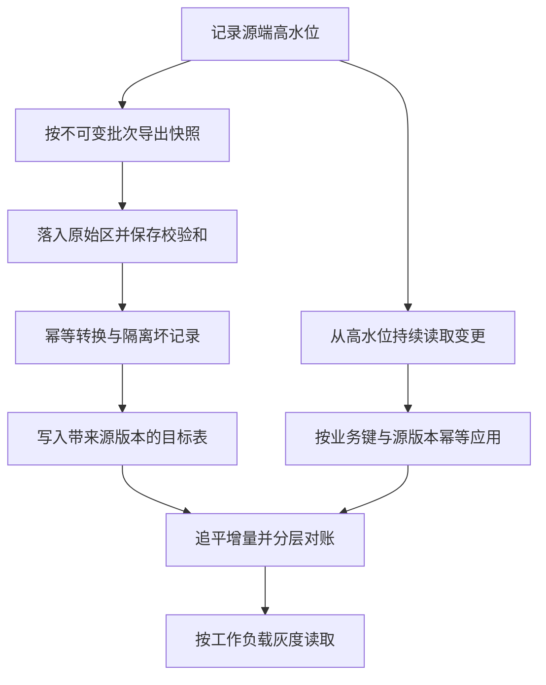

# 参考复盘：经典数据平台迁移

这不是唯一答案。复盘重点是哪些生产不变量必须守住，以及候选人如何从证据推导决策。

## 关键判断

### 迁移不是复制表

本题至少包含五个相互关联但可以分阶段的任务：历史回填、持续变化同步、业务语义统一、消费端切换、旧系统退役。把它们压成一个“周一切库”动作，会把每个问题的爆炸半径绑在一起。

### 行数和金额都不是充分证明

总金额可以在两条记录互相抵消时保持一致，行数也可能在一条缺失与一条重复同时发生时保持一致。可靠对账需要从批次、记录、事件序列、业务不变量和删除状态多层建立证据。

### 删除是数据契约，不是清理任务

已接受的删除仍可查询，已经构成阻断条件。物理删除源没有事件时，需要额外的删除账本、周期性反连接对账或源端审计信号；不能等主迁移结束后再补。

### 日期压力不等于风险授权

许可证可以高价续约，说明这是成本决策而不是不可抗力。FDE应把延期成本、隐私风险、财务差异和运营中断放在同一决策面上，让有权限的人签字，而不是替组织默默接受风险。

## 参考推演

### 1. 重写本阶段目标

一个更可交付的任务可以是：

> 十周内完成North地区近两年热数据的可重放回填和持续同步，先切换客服只读查询与履约看板；在隐私删除、财务对账和更新完整性连续达标后，再按地区迁移写入与财务报表。旧平台保留为权威写源，直到每类工作负载完成独立签字和回滚演练。

这不是放弃全量迁移，而是把不可逆退役放到证据之后。

### 2. 建立数据契约

至少明确四类语义：

- 全局业务键采用 `source_system + region + source_id`，原ID作为来源字段保留；
- 事件时间、源端提交时间和平台处理时间分开，时区未知的数据显式标记；
- 状态转移保留事件序列，不用最后状态覆盖历史；
- soft delete、physical delete和法务删除请求统一映射到版本化删除事件。

契约需要业务owner签署。技术团队不能独自决定退款何时算过账、订单何时算完成。

### 3. 衔接快照与增量

一种可行链路是：

批次、checkpoint、转换版本和错误原因都要可追踪。重跑只覆盖自己的版本或幂等合并，不能通过清空共享目标表获得“简单”。

### 4. 设计门禁

门禁必须按工作负载定义，不能只有一个全局百分比。例如：

- 隐私删除：目标查询层残留为零，24小时SLO内完成；
- 财务：日结净额误差小于0.05%，记录级差异都有分类；
- 客服：关键字段、后台更正和退款状态完整；
- 新鲜度：高峰p99延迟低于业务允许窗口；
- 恢复：至少演练一次停止消费、回滚读路由和重放积压。

### 5. 对第三轮作出决定

合理结论不是周一全切。可以切North的客服只读查询或继续小规模灰度，因为其证据最完整；Partner、Returns、财务报表和写入切换继续阻断。立即续约一个月，为修复主键命名空间、后台更正捕获和删除传播购买确定时间。

试点客服的317条新备注需要导回权威系统、双写或冻结新写入，不能在回滚时丢失。下一次评审应给出明确日期、数据owner和门禁，而不是无限延期。

### 6. 沉淀复用能力

平台能力包括数据契约模板、source checkpoint、幂等导入、删除传播、分层对账、差异工单和切换门禁；地区状态映射、财务容差和具体业务owner保留为配置。这样下一次迁移复用的是控制面，不是复制脚本。

## 常见失败

- 一听迁移就讨论Kafka、湖仓或某个云产品，没有先确认谁读、谁写、谁签字；
- 用“最终一致”掩盖没有定义允许多久和错误由谁承担；
- 建议双写，却没有权威源、幂等、失败顺序和回滚合并；
- 发现数据很脏后提出全量清洗，没有按业务风险缩范围；
- 只给技术状态，不向CIO明确说明现在能切什么、不能切什么以及延期代价；
- 把历史冷数据全部迁完当作上线前置，反而拖延高价值热数据闭环。

优秀答案不一定和本推演相同，但应让每个切换动作都可以被证据解释、被责任人签署、在失败时恢复。
