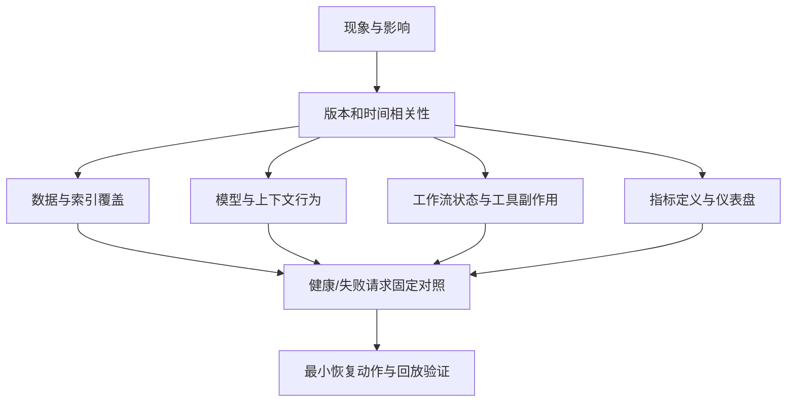

# 参考复盘：生产事故指挥

本事故没有一个能解释全部现象的单点根因。高质量处理需要把三条故障链分别止血、验证和修复，再解释为什么原有门禁与指标没有及时发现。

## 关键判断

### 先控制不可逆影响

答案质量下降可以暂时降级到人工搜索或旧索引，重复资金动作却会继续造成客户伤害。第一优先级是关闭额度写工具或强制人工在原账务系统完成，同时保留Copilot只读能力是否继续要看风险和人工路径。

### 超时代表结果未知

调用方没有在三秒内收到响应，只能证明响应未知，不能证明服务端没有执行。跨网络副作用要用业务幂等键、结果查询、账本和补偿处理，不能靠run级重试次数获得“只执行一次”。

### “没有模型发布”不能缩小全部变更面

AI系统的生产行为还受知识数据、索引、解析器、工具、配置、依赖、策略和指标定义影响。本题模型与prompt未变是真的，但不能据此推导系统没变。

### 监控本身也是事故对象

把partial计为workflow成功可以用于观察运行时可用性，却不能代表回答有证据或资金动作唯一。指标名称过宽、门禁只看任务状态，导致系统对客户已经失败时内部仍显示91%。

## 参考推演

### 1. 前十分钟

一组合理动作顺序是：

1. 宣布事故并指定技术指挥、客户沟通和记录owner；
2. 关闭额度工具或将其切到原有人工流程，保留第三方账本和调用日志；
3. 将知识索引别名切回已知完整版本，暂停自动索引晋级；
4. 冻结相关配置发布，保存当前版本、trace、队列状态和影响账户清单；
5. 告知客服当前降级路径、已知影响和下一次更新时间；
6. 并行核对重复额度范围，不等待根因完全确定后才补偿。

是否关闭整个Copilot取决于旧索引回退后的质量、安全证据和人工承载能力。重点是按能力面隔离，不必把所有功能一起关掉。

### 2. 建立分层假设

健康trace和失败trace显示模型、prompt相同，索引版本与文档数不同；重复调用trace显示同一case被两个run使用不同幂等键执行。这些证据比“某团队说没发布”更能缩小原因。

### 3. 拆开因果链

质量下降的直接原因是新索引缺少大量文档。促成因素是SDK分页契约变化、wrapper没有消费新cursor、构建成功只检查HTTP状态、自动晋级没有覆盖率和高风险回放门禁。

重复额度的直接原因是调用已成功但响应超时后发生重试。促成因素是超时低于下游p99、幂等键绑定run而不是业务动作、没有先查询结果、指标不检查副作用唯一性。

仪表盘误导不是前两者的直接原因，却是控制缺口：它让内部“成功”与客服结果失去一致含义，延迟了定级和影响判断。

### 4. 恢复并证明恢复

索引先切回已知完整版本，再修复分页逻辑并从最后可信checkpoint重建。新索引只有在文档数、ACL、删除、关键意图回放、引用支持和差异审查达标后才能晋级。

额度工具保持关闭，直到使用稳定业务键，例如 `tenant + case + action_type + policy_version`，并在第三方侧或本地账本建立唯一约束。超时后先按reference查询结果；确认未执行才重试。对14个已知账户及全量时间窗进行账务对账，由客户运营决定撤销、保留或沟通补偿。

恢复门禁至少包括：有证据支持的解决率回到阈值、关键意图回放通过、索引覆盖和删除对账通过、额度动作唯一性测试通过、队列积压可控、客服确认人工路径正常。不能只看workflow_success回升。

### 5. 对外更新

两分钟更新可以这样组织：

> 当前确认知识回答质量下降，并有14个账户出现重复额度。我们已停止额度自动写入、回退到上一完整知识索引，并保留人工处理路径。现有证据指向知识同步分页变化和工具超时重试两条独立故障链；尚未发现跨租户泄漏，但全量核对仍在进行。下一步在30分钟内完成受影响账户清单和旧索引回放验证，届时更新恢复范围与客户沟通方案。

这段话区分了已确认、正在验证和下一次承诺，没有提前宣布完全恢复。

### 6. 防复发

- 索引发布：上一版本差异、文档/删除覆盖、高风险回放和人工审批；
- 外部动作：业务幂等键、结果查询、唯一账本、补偿和并发测试；
- 指标语义：运行完成、答案证据、工具副作用、人工接管分别命名；
- 变更治理：主应用、配置、数据、依赖、模型、prompt、工具和指标进入同一变更时间线；
- 演练：索引回退、下游超时、未知结果和重复动作纳入故障演练。

## 常见失败

- 一上来回滚模型，虽然没有证据表明模型变化；
- 花二十分钟列所有可能性，却没有关闭资金写入；
- 只修分页bug，不检查为什么残缺索引能自动晋级；
- 把幂等键写成随机请求ID，每次重试仍然不同；
- 认为队列“exactly once”可以覆盖第三方已经执行但响应丢失；
- 指标恢复后马上宣布结束，没有做记录级对账和客户补偿；
- 复盘只写“加强测试、加强监控”，没有明确具体门禁、owner和演练。

真正资深的事故处理不是显得最早猜中，而是在不确定中减少客户伤害，并让每条结论都能被时间线和请求证据支撑。
