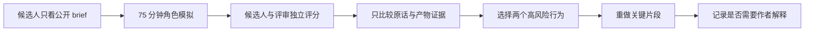

# 角色定向模拟面试

> 三套原创、无公司归属的盲练脚本，用来检验岗位证据是否真的能在追问、压力和新信息下成立。

## 为什么还需要这一层

通用模拟能检查 FDE 基本功，但无法充分暴露“主工程脊柱”上的薄弱点。AI / Agent 候选人可能会用框架名掩盖工具副作用，数据平台候选人可能会用组件图掩盖删除与回放，受监管部署候选人可能会用合规术语掩盖责任和证据。

角色定向模拟不预测任何公司的真实题目。它把[岗位作战包](../../role-playbooks/README.md)中的公开能力信号，转换成原创场景和可观察行为：

| 模拟 | 主要压力 | 候选人材料 | 主持人材料 |
| --- | --- | --- | --- |
| AI / Agent FDE | 自动化程度、工具副作用、评测与采用 | [打开](ai-agent-fde/candidate-brief.md) | [打开](ai-agent-fde/interviewer-guide.md) |
| 数据平台 FDE | 身份、删除、回放、质量与客户运营 | [打开](data-platform-fde/candidate-brief.md) | [打开](data-platform-fde/interviewer-guide.md) |
| 受监管 AI 部署 FDE | 权限、证据、审批、变更与责任 | [打开](regulated-ai-fde/candidate-brief.md) | [打开](regulated-ai-fde/interviewer-guide.md) |

## 标准运行方式

1. 主持人先读 interviewer guide，候选人只能看到 candidate brief；
2. 正式模拟 75 分钟，中途不教学、不提示框架名；
3. 候选人与评审分别填写[角色定向评分表](score-sheet.md)；
4. 出现一分以上分歧时，先引用原话和白板证据，再设计一个区分性追问；
5. 复盘只选择两个下一步行为，立即重做相关片段；
6. 若用于项目试用，按照[匿名试用协议](pilot-protocol.md)记录，不收集真实面试题和个人敏感信息。

## 主持人不能做什么

- 不把自己的技术偏好当标准答案；
- 不因候选人没有说出某个产品名而扣分；
- 不主动念完所有私有证据；
- 不在正式阶段教候选人使用 FIELD 或 TRACE；
- 不把语言流畅等同于证据充分；
- 不追问真实客户名称、内部数据或保密代码；
- 不把本套模拟说成任何公司的面经。

## 完成标准

一次有效模拟至少出现：

- 一处由新证据触发的判断更新；
- 一个明确非目标、停止条件或回退条件；
- 一项可运行、可画出或可检查的工程产物；
- 一次对个人证据边界的诚实说明；
- 两条引用候选人原话的评分依据；
- 一个重做后可以比较的行为变化。

如果主持人需要作者在线解释证据何时释放、该追问什么或怎样评分，这套材料仍不算独立可运行，应记录在 pilot 中修订。

---

[返回岗位作战包](../../role-playbooks/README.md) · [角色定向评分表](score-sheet.md) · [匿名试用协议](pilot-protocol.md)
