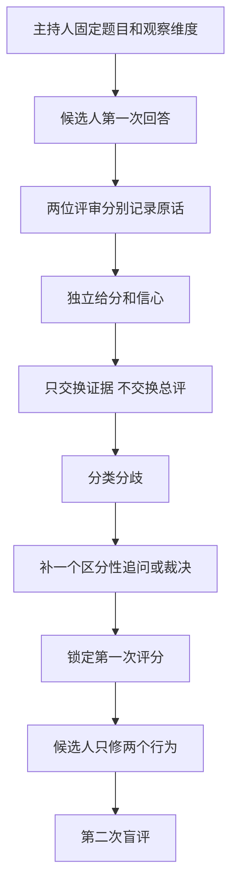

# 评审者盲评、裁决与复评分离协议

> 本协议用于同伴训练和课程评审，不代表任何雇主的内部标准。它解决的是“评审能否从同一段可观察证据得出可解释的判断”，不测量录取概率。

## 1. 先固定评分单位

一次回答不能自动覆盖全部八个维度。题前最多选择三个主要观察维度，并写明目标岗位和假设级别。评审只对本轮有观察机会的维度给数值分；其余使用 `N/O`。

```text
题目：
目标岗位：
假设级别：初级 / 中级 / 资深 / 未指定
主要观察维度：
允许追问数：
回答时间盒：
```

评分单位是“一个维度上的一组行为证据”，不是候选人的人格、资历、公司背景或整场印象。

## 2. N/O 与 1 分不能混用

- **N/O — Not Observed：** 题目、时间或追问没有暴露能力；
- **1 分 — 危险：** 候选人已经做出会把不确定性转成客户或生产风险的判断。

如果 discovery 题没有让候选人写代码，编码维度是 N/O，不是 1 分。相反，如果候选人明确建议在未知最终状态下重复退款，即使表达流畅，也应在相关安全和系统维度记 1 分。

遗漏只有在题目明确创造观察机会时才能成为证据。例如候选人被要求给出上线方案，却在两次追问后仍拒绝讨论回退，可以评分；三分钟开场没有主动讲所有监控字段，通常不能。

## 3. 评分证据的优先顺序

从强到弱记录：

1. **实际产物：** 代码、测试、白板、状态机、决策表；
2. **明确决定：** 做什么、不做什么、何时停止；
3. **依据与反证：** 哪条事实支撑，什么证据会改变决定；
4. **恢复和 owner：** 失败后谁做什么，怎样证明恢复；
5. **术语或意图：** “会加灰度”“注意安全”只能作为低强度信号。

评分记录必须引用原话或产物位置。不能只写“思路成熟”“比较 senior”“懂生产”。

## 4. 信心与分数分开

分数回答“已观察行为处于哪一档”，信心回答“当前证据是否足够稳定”。

| 信心 | 使用条件 | 评审动作 |
| --- | --- | --- |
| 高 | 多处一致原话或产物，关键追问已覆盖 | 可以用于行为修复和跨轮比较 |
| 中 | 有直接证据，但边界或反例不足 | 保留分数，补一个区分性追问 |
| 低 | 样本太短、题目偏离或只出现间接信号 | 不扩大结论，优先改题或追加观察 |

“3 分、低信心”不应自动降成 2 分；“4 分、低信心”也不能因候选人资历被保留。先说明证据缺口。

## 5. 标准盲评流程



关键隔离规则：

- 评审 A 和 B 在提交前看不到对方分数；
- 先交换原话证据，再交换分数；
- 参考答案和预期评分在第一次评分锁定前不可见；
- 第二次由条件允许时更换评审；
- 第一次评分不能因看到参考答案而被覆盖，只能追加裁决说明。

## 6. 六类分歧

| 代码 | 分歧来源 | 典型表现 | 处理方式 |
| --- | --- | --- | --- |
| `no-observation-as-low` | 把没看到当不会 | discovery 题给编码 1 分 | 改为 N/O，另设观察任务 |
| `term-density` | 把名词当能力 | 说 MCP、Agent、eval 就上调 | 追问状态、失败、owner 和停止 |
| `role-level` | 两人使用不同级别预期 | 同一独立交付一人给 3、一人给 4 | 题前固定级别，4 分必须有杠杆证据 |
| `risk-underweight` | 低估尾部风险 | 把重复退款看成小瑕疵 | 先看一票否决和不可逆后果 |
| `product-leverage-overreach` | 完整回答被误判为组织杠杆 | 全面就给 4 分 | 查第二场景、owner、迁移和复用证据 |
| `evidence-inference` | 评审替候选人补答案 | “他说灰度，肯定知道回退” | 只保留原话，追加区分性追问 |

分歧可以同时属于两类，但必须选一个首要原因，否则复盘无法形成材料修订。

## 7. 裁决顺序

分差超过一级、N/O 与数值冲突，或一方触发一票否决时，按顺序处理：

1. 比较两人引用的是否是同一段证据；
2. 检查题目是否真的给了观察机会；
3. 检查是否把术语、资历或结果光环当作行为；
4. 回到[证据锚点库](evidence-anchor-library.md)找区分行为；
5. 若原回答不足，追加一个区分性追问；
6. 仍不足时保留 N/O 或降低信心，不用平均分制造确定性；
7. 记录是修改题目、追问、锚点还是评审培训。

2 分与 4 分不能平均成 3 分。平均值会掩盖双方可能在评不同维度或不同级别。

## 8. 第二次评分测什么

候选人复盘后只修改两个行为。第二次评分要保留：

- 相同题目或等价难度；
- 相同主要观察维度；
- 第一次的风险触发条件；
- 新评审不知道第一次分数更好；
- 对比原话和产物，不只比较长度与流畅度。

分数上升不是唯一成功。候选人可能更诚实地把直接证据降为练习、主动承认未知，数值不变但可信度提升。记录行为变化而不是追求曲线。

## 9. 怎样计算分歧

使用 `scripts/summarize_calibration.py` 读取隐私安全的 JSON 评分记录，输出：

- 数值评分对数量；
- 完全一致率；
- 相差不超过一级的比例；
- 平均绝对分差；
- N/O 与数值冲突数；
- 1 分与 3/4 分的否决风险冲突数。

这些指标描述评审体系，不描述候选人能力。样本少时必须同时报告分母，不发布单独百分比。

## 10. 评分记录最小结构

```json
{
  "schema_version": "1.0",
  "ratings": [
    {
      "scenario_id": "synthetic-or-anonymous-id",
      "reviewer_id": "anonymous-reviewer-a",
      "dimension": "discovery",
      "rating": "3",
      "confidence": "medium",
      "evidence": "Exact statement or artifact position"
    }
  ]
}
```

不得记录姓名、公司、真实面试题、客户数据或付费材料。`reviewer_id` 只需要在一次校准批次内稳定。

## 11. 何时修改材料

出现以下任一情况就应修改题目或锚点，而不是责怪评审：

- 多位评审持续把同一维度记为 N/O；
- 分歧无法通过一个区分性追问解决；
- 一票否决行为在评分表中没有明确位置；
- 4 分必须依靠评审想象才能成立；
- 学员收到反馈后不知道下一次具体改什么；
- 主持人必须找作者解释证据释放或评分含义。

## 12. 本项目当前证据边界

仓库提供机器检查的合成场景和协议，可以达到 A1。只有真实的两位独立评审完成盲评、保留分歧并形成材料修订，才构成 H1/H2 证据。项目当前不提交任何虚构的一致率或“已证明评分可靠”结论。

---

[评审者校准指南](reviewer-calibration.md) · [证据锚点库](evidence-anchor-library.md) · [校准记录模板](../worksheets/reviewer-calibration-record.md)
